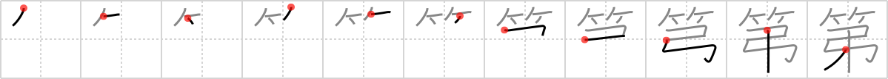

## {1239}

## `No.`

## [11]

## Reading:

### On-Yomi: ダイ、テイ

## Words:

第(だい): ordinal

第一(だいいち): first, foremost, # 1

次第(しだい): order, precedence, circumstances, immediate(ly), as soon as, dependent upon

落第(らくだい): failure, dropping out of a class
