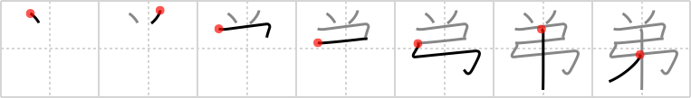

## {1240}

## `younger brother`

## [7]

## Reading:

### On-Yomi: テイ、ダイ、デ &mdash; Kun-Yomi: おとうと

### Examples: 弟妹 (ていまい), 義弟 (ぎてい), 子弟 (してい), 兄弟 (きょうだい), 弟 (おとうと)

## Words:

弟(おと): younger brother

従兄弟(いとこ): male cousin

弟(おとうと): younger brother, faithful service to those older, brotherly affection

兄弟(きょうだい): siblings
