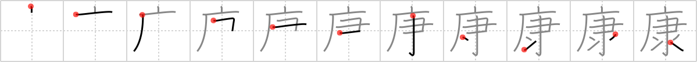

## `sane`

## [11]

## Reading:

### On-Yomi: コウ

## Heisig story:

Cave . . . sieve.

## Premitive:

sieve A rake and the grains of rice at the bottom give us a hint of winnowing, which relates clearly to the meaning of a sieve. [8]

## Koohii stories:

1) [<a href="http://kanji.koohii.com/profile/laxxy">laxxy</a>] 25-8-2006(285): A psychiatric hospital is located in a CAVE. To determine, which patients are<strong> sane</strong> and can be released, they are given a SIEVE and asked to empty a bathtub (the<strong> sane</strong> ones take out the plug and get the water out with <strong>ease</strong>).

2) [<a href="http://kanji.koohii.com/profile/esaulgd">esaulgd</a>] 16-9-2007(95): People on the <em>cave</em> age became more<strong> sane</strong> after they started using <em>sieves</em> to avoid eating harmful things with their grains. (This kanji is almost exclusively used to write 健康 , health).

3) [<a href="http://kanji.koohii.com/profile/matt_jenkins">matt_jenkins</a>] 16-4-2008(50): Ever since I meditated in the <em>cave</em> and realised that wearing a <em>sieve</em> on my head would stop the C.I.A controlling my thoughts, I&#039;ve been completely<strong> SANE</strong>.

4) [<a href="http://kanji.koohii.com/profile/dingomick">dingomick</a>] 30-12-2006(26): Japanese doctors recommend you retreat to a <em>cave</em> every week to <em>sieve</em> rice through a <em>rake</em>. It will keep you <strong>sane</strong>, sound, healthy, and wholesome.

5) [<a href="http://kanji.koohii.com/profile/richcoop">richcoop</a>] 23-9-2008(10): A<strong> sane</strong> person in a polluted CAVE will use a SIEVE to breath.

6) [<a href="http://kanji.koohii.com/profile/torida">torida</a>] 26-5-2010(8): A psychiatric hospital located deep in a CAVE. To find out which patients are<strong> sane</strong> they are given a SIEVE and asked to empty a bathtub (the<strong> sane</strong> ones take out the plug and empty it with <strong>ease</strong>, the rest get put away in the cave forever). [..... thanks laxxy - removed confusing element for water].

7) [<a href="http://kanji.koohii.com/profile/radical_tyro">radical_tyro</a>] 22-6-2007(8): Any<strong> sane</strong> person knows that the best place to <em>sieve</em> for gold is in a <em>cave</em>.

8) [<a href="http://kanji.koohii.com/profile/herman">herman</a>] 22-11-2008(5): Raking rice in a cave is something that can be done with ease and it keeps your mind<strong> sane</strong> by bringing inner peace.

9) [<a href="http://kanji.koohii.com/profile/Elphalpo">Elphalpo</a>] 12-8-2008(5): To stay<strong> sane</strong>, I often go into a <em>cave</em> and meditate, which acts like a <em>sieve</em> that filters out the madness from my mind.

10) [<a href="http://kanji.koohii.com/profile/kapalama">kapalama</a>] 21-8-2011(4): 健康 , 小康 (Xiaokang), 康熙字典 , <a href="../v4/1159">ease/sane</a> (#1159 康)コウ ... Parts: 广, 隶 (cf 隷 <a href="../v4/2036">slave</a> (#2036 隷), 米糠 <a href="../v4/2652">rice bran</a> (#2652 糠), 逮捕 <a href="../v4/1160">apprehend</a> (#1160 逮)) ... Note: Heisig uses the name &#039;Slave&#039; for 臣 ; 隶 is the &#039;slave&#039; radical; kanji for slave is 隷 . ... Story: The only way a <em>Slave</em> can have a life of <strong>ease</strong> or even just to stay <strong>sane</strong>, is to hide in a <em>cave</em>.

### {V4: 1159, V6: 1243}
