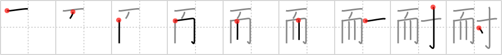

## `-proof`

## [9]

## Reading:

### On-Yomi: タイ &mdash; Kun-Yomi: た.える

## Heisig story:

The key word is a suffix used to indicate &quot;safe from&quot; or &quot;protected against,&quot; as in the words rust<b>proof</b>, water<b>proof</b>, and fire<b>proof</b>. It is composed of: <i>comb</i> . . . <i>glue</i>.

## Premitive:

comb The pictograph of a comb is clearly visible in this primitive element. [6]

## Koohii stories:

1) [<a href="http://kanji.koohii.com/profile/laner36">laner36</a>] 3-10-2007(314): [akrodha] My comb is rust-proof, water-proof, and fire-proof. But unfortunately it is not idiot-proof--and I glued it to myself.

2) [<a href="http://kanji.koohii.com/profile/akrodha">akrodha</a>] 3-2-2007(91): I spent $100 recently on this excellent rust-proof, water-proof, fire-proof comb. But two days after having bought it, I left it in my back pocket and sat down, snapping this expensive comb in half! I glued it back together, but now every time I try to comb through my thick hair, it just breaks apart again. I guess my comb is also glue-proof.

3) [<a href="http://kanji.koohii.com/profile/harusame">harusame</a>] 30-5-2009(51): <em>Glue</em> your hair together and it will be <em>comb</em><strong>-proof</strong>.

4) [<a href="http://kanji.koohii.com/profile/dingomick">dingomick</a>] 17-4-2007(16): Urushi is one of the hardest lacquers(and glues) known to man. It&#039;s<strong> -proof</strong>ed against everything: acid, oil, water, heat, etc. They found a 6,000yo urushi comb in Japan! <a href="http://www.urushi-kobo.com/history.html">http://www.urushi-kobo.com/history.html</a>.

5) [<a href="http://kanji.koohii.com/profile/thelooseteeth">thelooseteeth</a>] 10-3-2009(12): My <em>comb</em> is <em>glue</em>-<strong>proof</strong>!

6) [<a href="http://kanji.koohii.com/profile/Viking101">Viking101</a>] 4-1-2010(9): Gluing combs all over your body does not make you <strong>bulletproof</strong>.

7) [<a href="http://kanji.koohii.com/profile/raulir">raulir</a>] 24-5-2006(9): To mke your hairstyle wind<strong>proof</strong>, first use a comb and then glue (gel).

8) [<a href="http://kanji.koohii.com/profile/zz_alex_zz">zz_alex_zz</a>] 24-1-2008(6): NEW FOR THE BALDING MAN. Cover your <em>comb</em> with this magic <em>glue</em> and your hair line will become recede-<strong>proof</strong>.

9) [<a href="http://kanji.koohii.com/profile/Skinny">Skinny</a>] 27-5-2009(5): Wind-proof and water-proof hair? Comb with glue.

10) [<a href="http://kanji.koohii.com/profile/akira">akira</a>] 24-8-2007(5): This comb is hair stick-proof.

### {V4: 1164, V6: 1248}
