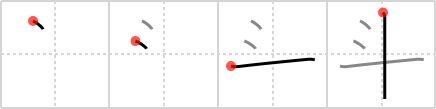

## `Big Dipper`

## [4]

## Reading:

### On-Yomi: ト、トウ

## Heisig story:

The <b>Big Dipper</b> here is of course the constellation of Ursa Major, of which this kanji is a sort of pictographic representation.

## Koohii stories:

1) [<a href="http://kanji.koohii.com/profile/snallygaster">snallygaster</a>] 7-10-2007(162): Since the meaning of &quot;big dipper&quot; is rather specific and the sense of measurement seems to be a more common usage, I concentrate on the primative meaning of <strong>measuring cup</strong>. This is a pictograph, with the first two strokes representing the measuring ticks on the side of the cup.

2) [<a href="http://kanji.koohii.com/profile/ihatobu">ihatobu</a>] 10-10-2008(98): Is it just me, or do all of these traditional kanji pictographs look like they were drawn by a retarded bunny rabbit?

3) [<a href="http://kanji.koohii.com/profile/Viking101">Viking101</a>] 4-1-2010(30): I looked out my window frame and saw two shooting stars slashing through the<strong> big dipper</strong>. Primitive: Big Gulp cup from 7-11.

4) [<a href="http://kanji.koohii.com/profile/igordesu">igordesu</a>] 13-1-2009(22): This does not look like the<strong> big dipper</strong> or 18 liters of anything in any way, shape, or form.

5) [<a href="http://kanji.koohii.com/profile/meiko452">meiko452</a>] 11-11-2010(11): The<strong> Big Dipper</strong> is a celestial measuring cup.

6) [<a href="http://kanji.koohii.com/profile/shuusaku">shuusaku</a>] 26-8-2009(5): The<strong> BIG DIPPER</strong> looks like TWO stars followed by a CROSS.

7) [<a href="http://kanji.koohii.com/profile/claxton">claxton</a>] 26-7-2008(5): Growing up in an farm-based economy, I&#039;ve known many &quot;big dippers&quot;. The more &quot;common&quot; ones will spit in the corner if (see the pictograph in the kanji of this activity) but the &quot;classier&quot; ones prefer to carry around a huge, self-serve soda cup from 7-11 that they make deposits in throughout the day... No, the Big Gulp doesn&#039;t hold 18 liters but it does hold exactly 1 liter and I&#039;ve seen it used as a measuring cup for everything from gasoline for lawn mowers to keg-beer for chug-a-lug contests.

8) [<a href="http://kanji.koohii.com/profile/andresito">andresito</a>] 13-5-2009(4): Ice cross needle. Think of it as <strong>big nipple</strong>, where ice feels funny and a crossing needle hurts.

9) [<a href="http://kanji.koohii.com/profile/Teskal">Teskal</a>] 20-4-2009(4): German: Man braucht schon einen Großen Wagen um mehrere Einheiten je 18 Liter zu schleppen. Hier wird ein Trichter abgebildet, der normalerweise dazu genutzt wird um den Wagen zu füllen.

10) [<a href="http://kanji.koohii.com/profile/Hujis">Hujis</a>] 2-3-2009(4): I&#039;m going to use the metal bowl inside my rice steamer for this one, it has a measure on the side for the water level. The measure is a vertical line, you intersect the <em>water</em> level against the vertical line. The timers broken so I measure the movement of the<strong> big dipper</strong> to time the rice.
