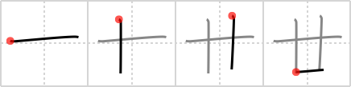

## `twenty`

## [4]

## Reading:

### On-Yomi: ジュウ、ニュウ &mdash; Kun-Yomi: にじゅう

## Heisig story:

The two <i>tens</i> joined at the bottom by a short line is actually the old character for <b>twenty</b>, which we might as well learn since we need its primitive form. It is written the same as <i>salad</i>, except for the shorter final stroke.

## Koohii stories:

1) [<a href="http://kanji.koohii.com/profile/stefanot">stefanot</a>] 24-3-2007(160): A <em>generation</em> is 30, one stroke less is<strong> twenty</strong>.

2) [<a href="http://kanji.koohii.com/profile/Pauline">Pauline</a>] 29-6-2006(62): <em>Ten</em> plus <em>ten</em> is<strong> twenty</strong> (see <a href="../v4/28">generation</a> (#28 世)).

3) [<a href="http://kanji.koohii.com/profile/lifeflaw">lifeflaw</a>] 15-3-2009(42): 十 <a href="../v4/10">ten</a> (#10 十)、廿 <a href="../v4/1190">twenty</a> (#1190 廿)、世 <a href="../v4/28">generation</a> (#28 世).

4) [<a href="http://kanji.koohii.com/profile/mattias">mattias</a>] 31-5-2010(14): <a href="http://google.com/#q=十、廿、丗">十、廿、丗</a> ... Ten,<strong> Twenty</strong>, Thirty... Japanese is logical as usual.

5) [<a href="http://kanji.koohii.com/profile/fagie37">fagie37</a>] 27-5-2008(9): I&#039;ll give you this<strong> twenty</strong> if you&#039;ll give me two tens. I just really got to break this<strong> twenty</strong>.

6) [<a href="http://kanji.koohii.com/profile/Viking101">Viking101</a>] 4-1-2010(5): Primitive: Barbara Walters from 20/20.

7) [<a href="http://kanji.koohii.com/profile/meiko452">meiko452</a>] 14-11-2010(4): <strong>Twenty</strong> is the joining of two TENS.

8) [<a href="http://kanji.koohii.com/profile/Culden2">Culden2</a>] 20-2-2010(3): Let&#039;s count to 20! 1,2,3...18,19...ten ten?

9) [<a href="http://kanji.koohii.com/profile/stshores24">stshores24</a>] 17-8-2008(2): Talk about inflation...McDonalds raised their salads up to<strong> twenty</strong> dollars, and the bowl is one-third its former size!

10) [<a href="http://kanji.koohii.com/profile/ruuku35">ruuku35</a>] 31-5-2007(2): I think of this as a pictogram of an OX.
