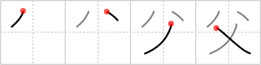

## {1274}

## `father`

## [4]

## Reading:

### On-Yomi: フ &mdash; Kun-Yomi: ちち

### Examples: 父 (ちち)

## Words:

お祖父さん(おじいさん): grandfather, male senior-citizen

伯父さん(おじさん): middle-aged gentleman, uncle

父母(ちちはは): father and mother, parents

小父さん(おじさん): middle-aged gentleman, uncle

父親(ちちおや): father

父母(ふぼ): father and mother, parents

祖父(そふ): grand father

叔父(おじ): uncle (younger than one´s parent)

お父さん(おとうさん): (polite) father
