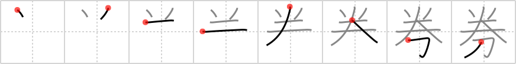

## `ticket`

## [8]

## Reading:

### On-Yomi: ケン

## Heisig story:

Quarter . . . dagger.

## Premitive:

quarter This character simply splits the vertical stroke of a half in half once again, to get a quarter. In so doing, it spreads the split stroke out to form a sort of enclosure under which its main relative primitive will be placed. It can be used either in its substantive or verbal meaning. [6]

## Koohii stories:

1) [<a href="http://kanji.koohii.com/profile/CharleyGarrett">CharleyGarrett</a>] 28-7-2007(386): Entering the movie, the dude asks for your <strong>ticket</strong>, so he can tear it in half. He looks at you funny when you hand him a<strong> ticket</strong> already torn in half. He quietly tears the stub into <em>quarter</em>s after you show him your <em>dagger</em> with a smile.

2) [<a href="http://kanji.koohii.com/profile/decamer0n">decamer0n</a>] 7-5-2007(28): In Japan, the JR railway ju-hachi-kippu seasonal discount<strong> ticket</strong> can be cut into <em>quarters</em> with a <em>dagger</em> and shared with your friends. (its actually sort-of true).

3) [<a href="http://kanji.koohii.com/profile/Tzadeck">Tzadeck</a>] 7-6-2009(24): Typically, about one <em>quarter</em> of a<strong> ticket</strong> with be separated by a perforated edge which the<strong> ticket</strong> guy will tear off when you are at the gate. However, this kanji was made waaay before perforated edges were invented. It used to be that the guy would cut off a <em>quarter</em> of your<strong> ticket</strong> with a <em>dagger</em>.

4) [<a href="http://kanji.koohii.com/profile/ruuku35">ruuku35</a>] 1-6-2007(17): Fact #1: A QUARTER of all<strong> TICKET</strong>S are obtained with DAGGERS.

5) [<a href="http://kanji.koohii.com/profile/sdrobertm">sdrobertm</a>] 7-2-2011(14): While a quarter may not buy you a<strong> ticket</strong>, a dagger will; if you know what I mean.

6) [<a href="http://kanji.koohii.com/profile/Axlen">Axlen</a>] 15-11-2010(7): &quot;Passengers without a<strong> Ticket</strong> will be &#039;<em>quartered</em>&#039; with this &#039;<em>dagger</em>&#039;,&quot; said the conductor with an evil grin on his face.

7) [<a href="http://kanji.koohii.com/profile/KeshaFran">KeshaFran</a>] 27-11-2010(6): This kanji is used for coupon<strong> ticket</strong>, which cuts the price of an item down only by a <em>QUARTER</em> (25%), and the cutting down of the price is represented by the <em>DAGGER</em>.

8) [<a href="http://kanji.koohii.com/profile/dtcamero">dtcamero</a>] 13-6-2010(5): I bought a<strong> TICKET</strong> to see that guy getting <em>QUARTERED</em> by a <em>DAGGER</em> - not cheap!

9) [<a href="http://kanji.koohii.com/profile/Melamelachan">Melamelachan</a>] 11-5-2012(4): &quot;What are you doing with that <em>dagger</em>?&quot; - &quot;I want a<strong> ticket</strong> for tonight&#039;s show, or else ...&quot; - &quot;Seriously?<strong> Ticket</strong>s are only a <em>quarter</em>, you know.&quot;.

10) [<a href="http://kanji.koohii.com/profile/sgrant">sgrant</a>] 30-11-2008(3): I heard the new horror film &quot;I know what you did with that <em>dagger</em>&quot; was so bad that they only charged a <em>quarter</em> per<strong> ticket</strong>.

### {V4: 1206, V6: 1291}
