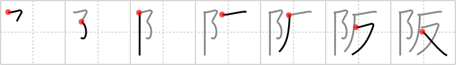

## `Heights`

## [7]

## Reading:

### On-Yomi: ハン &mdash; Kun-Yomi: さか

## Koohii stories:

1) [<a href="http://kanji.koohii.com/profile/dingomick">dingomick</a>] 27-8-2007(260): If you&#039;re scared of <strong>Heights</strong>, you don&#039;t want to stay at <em>The Pinnacle</em>; you are <em>anti-</em> <em>The Pinnacle</em>. Primitive: <em>The Pinnacle</em> is a dream-like gated community at the top of a mount. This allows for innumerable stories for all the kanji with this primitive since you have a whole city to work with. Also prevents confusion with &quot;mountain&quot;. 

2) [<a href="http://kanji.koohii.com/profile/wasurenaide">wasurenaide</a>] 6-12-2007(47): People are being displaced in   <a href="http://jisho.org/kanji/details/大阪">大阪</a>   to make room for a new development, Osaka<strong> Heights</strong>, the <em>pinnacle</em> of modern Japanese housing. An angry mob of protestors are outside with <em>Anti-</em>Osaka<strong> Heights</strong> signs. 

3) [<a href="http://kanji.koohii.com/profile/cefreddffo">cefreddffo</a>] 25-9-2009(23): This kanji is only used in names and in &quot;Osaka&quot;. By chance, last week my japanese friend told me that it used to be   <a href="http://jisho.org/kanji/details/大坂">大坂</a>  (as in &quot;slope&quot;), but Hideyoshi, the Taiko, didnt want to have anything to do with &quot;land&quot; (his ascendance were farmers...) so he replaced the &quot;earth&quot; for what we call &quot;pinnacle&quot;.　Its true.　　RTK2:　ハン　  <a href="http://jisho.org/kanji/details/阪神">阪神</a>  　はんしん(Osaka and Kobe)…　　MIXED GROUP:　  <a href="http://jisho.org/kanji/details/反">反</a>  722　  <a href="http://jisho.org/kanji/details/坂">坂</a>  723　  <a href="http://jisho.org/kanji/details/板">板</a>  724　  <a href="http://jisho.org/kanji/details/販">販</a>  726　  <a href="http://jisho.org/kanji/details/版">版</a>  1213　  <a href="http://jisho.org/kanji/details/飯">飯</a>  1473　(ﾍﾝ):   <a href="http://jisho.org/kanji/details/返">返</a>  725　(ｶ):   <a href="http://jisho.org/kanji/details/仮">仮</a>  966. 

4) [<a href="http://kanji.koohii.com/profile/decamer0n">decamer0n</a>] 17-5-2007(19): Just by changing the soil in <a href="../723">slope</a> (#723 <a href="http://jisho.org/kanji/details/坂">坂</a>) to a <em>pinnacle</em> you get to the<strong> Heights</strong>. If only reaching the top of Everest were this easy... 

5) [<a href="http://kanji.koohii.com/profile/Johnnyltn">Johnnyltn</a>] 23-9-2006(10): Hint: Try naming the primitive <em>pinnacle</em> &quot;<em>The Pinnacle</em>&quot;. Giving it a place name sort of sets the image firmly in mind. &quot;<em>The Pinnacle</em>&quot; can then become a large facility set on a <em>pinnacle</em> overlooking a city or valley or whatever of your choice. In this facility are many functions such as restaruants, sports areas, rooms, halls etc. which can eventually be used in forming kanji in the future. 

6) [<a href="http://kanji.koohii.com/profile/Transtic">Transtic</a>] 5-2-2008(8): This is the second kanji for &quot;Osaka&quot;, home of the <strong>pinnacle</strong> of the <strong>anti-heroes</strong>, Hard Gay. (true) (I use Hard Gay for <strong>anti</strong>, and also for crotch). If you still need the keyword, just imagine a place called &quot;Osaka <strong>HEIGHTS</strong>&quot;, home for Hard Gay. 

7) [<a href="http://kanji.koohii.com/profile/PenguinOnTheGreen">PenguinOnTheGreen</a>] 15-7-2008(6): Hint- Make pinnacle &quot;the empire state building&quot; or whatever your favorite skyscraper is--- Pinnacle is too abstract. 

8) [<a href="http://kanji.koohii.com/profile/Rujiel">Rujiel</a>] 26-3-2010(5): Used in &quot;Osaka&quot;:　  <a href="http://jisho.org/kanji/details/大阪">大阪</a>  . Imagine a large, rolling hill. This marks the first RTK occurrence of <strong>阝</strong>, a common primitive. This guy can be confusing because it is the simplification of two unrelated characters:   <a href="http://jisho.org/kanji/details/阜">阜</a>   <a href="../2928">large hill</a> (#2928 <a href="http://jisho.org/kanji/details/阜">阜</a>) and   <a href="http://jisho.org/kanji/details/邑">邑</a>   <a href="../2180">city walls</a> (#2180 <a href="http://jisho.org/kanji/details/邑">邑</a>). Fortunately, 阝 appears on the left when its root primitive is <em>large hill</em>, and on the right when its primitive is <em>city walls</em>. It will help to distinguish this in your primitives. 

9) [<a href="http://kanji.koohii.com/profile/ddstevenson">ddstevenson</a>] 29-3-2013(4): &quot;Pinnacle&quot;, while apt, has not brought me great results. So I&#039;m renaming the left-hand primitive to &quot;Barack Obama&quot;. Because it looks like a B? And because Obama reached the pinnacle of political success? And because it looks like a good fit for all of Heisig&#039;s pinnacle kanji. I&#039;ll be sharing stories for every one of them. STORY: &quot;The<strong> Heights</strong>&quot; is a gated community that rejected Obama&#039;s application. Were they racist? Or simply anti-Obama? 

10) [<a href="http://kanji.koohii.com/profile/nest0r">nest0r</a>] 24-1-2008(4): For <em>pinnacle</em>, I can&#039;t help but feel like I&#039;m drawing that profile silhouette of Alfred Hitchcock, a <em>pinnacle</em> of a director. He was born on August 13, and directed a film called Number 13, if that helps. Originally Vertigo, that Hitchcock film about being <em>anti-</em><strong> Heights</strong>, was simply called The<strong> Heights</strong>, they changed it last minute for marketing purposes, to help it reach its <em>pinnacle</em> at the box office. 
