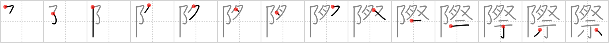

## `occasion`

## [14]

## Reading:

### On-Yomi: サイ &mdash; Kun-Yomi: きわ、-ぎわ

### Examples: 際 (きわ)

## Words:

際(きわ): edge, brink, verge, side

手際(てぎわ): performance, skill, tact

交際(こうさい): company, friendship, association, society, acquaintance

際(さい): edge, brink, verge, side

実際(じっさい): practical, actual condition, status quo

国際(こくさい): international

## Koohii stories:

1) [<a href="http://kanji.koohii.com/profile/radical_tyro">radical_tyro</a>] 26-6-2007(194): On occasian, <em>rituals</em> are held at the very tip of <em>The Pinnacle</em>. 

2) [<a href="http://kanji.koohii.com/profile/mspertus">mspertus</a>] 4-9-2006(68): Many <em>rituals</em> are practiced every day (blessing before meals, evening prayer, etc.) Only the <em>peak</em> <em>rituals</em> (wedding, Bar Mitzvah, etc.) qualify to be called an<strong> occasion</strong>. 

3) [<a href="http://kanji.koohii.com/profile/dingomick">dingomick</a>] 5-2-2007(36): The <strong>international</strong> <em>penis matsuri</em> at <em>The Pinnacle</em> is the biggest<strong> occasion</strong> of the year. 

4) [<a href="http://kanji.koohii.com/profile/rtkrtk">rtkrtk</a>] 21-2-2008(19): Wordplay (occastion-&gt;caucasian). <em>The Pinnacle</em> is a whites-only community, and is a favorite place for white-supremacy <em>rituals</em>. The motto of the Pinnacle: &quot;the best in caucasian<strong> occasion</strong>s&quot;. 

5) [<a href="http://kanji.koohii.com/profile/Perry">Perry</a>] 22-1-2009(14): They usually do the A-ritual, but on a special<strong> occasion</strong> they do the B-ritual. 

6) [<a href="http://kanji.koohii.com/profile/smithsonian">smithsonian</a>] 16-4-2007(6): The couple chose the <em>pinnacle</em> of the village to do the <em>ritual</em> of marriage, since it&#039;s such an important<strong> occasion</strong>. 

7) [<a href="http://kanji.koohii.com/profile/edmosis">edmosis</a>] 28-12-2012(4): Hold your next<strong> OCCASION</strong> at the <em>The Pinnacle</em>. We have special spaces for all kinds of <em>rituals</em>. Weddings, Bar Mitzvahs, circumcisions, you name it, we have your<strong> OCCASION</strong> covered. 

8) [<a href="http://kanji.koohii.com/profile/akahige">akahige</a>] 15-4-2009(4): <strong>Occasion</strong>ally at <em>The Pinnacle</em>, there are <em>rituals</em> near the edge of a cliff. (This kanji also means &quot;edge&quot;). 

9) [<a href="http://kanji.koohii.com/profile/hugh2323">hugh2323</a>] 1-9-2012(3): On<strong> OCCASION</strong>, the people of the PINNACLE perform a RITUAL to help keep their island floating in the sky. 

10) [<a href="http://kanji.koohii.com/profile/SammyB">SammyB</a>] 19-8-2008(3): In the <em>acropolis</em> most important <strong>occasions</strong> are related to <em>rituals</em>. 
