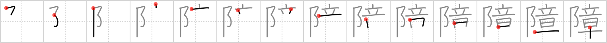

## {1297}

## `hinder`

## [14]

## Reading:

### On-Yomi: ショウ &mdash; Kun-Yomi: さわ.る

### Examples: 障る (さわ.る)

## Words:

気障(きざ): affectation, conceit, snobbery

障る(さわる): to hinder, to interfere with, to affect, to do one harm, to be harmful to

保障(ほしょう): guarantee, security, assurance, pledge, warranty

障害(しょうがい): obstacle, impediment (fault), damage

障子(しょうじ): paper sliding door

故障(こしょう): breakdown
