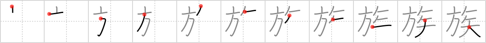

## `tribe`

## [11]

## Reading:

### On-Yomi: ゾク

## Heisig story:

Banner . . . dart.

## Koohii stories:

1) [<a href="http://kanji.koohii.com/profile/smithsonian">smithsonian</a>] 12-3-2007(284): With a <em>banner</em> declaring &quot;Keep Out!&quot; and blow <em>darts</em> to back it up, the Amazon<strong> tribe</strong> is not that friendly.

2) [<a href="http://kanji.koohii.com/profile/mspertus">mspertus</a>] 20-12-2006(45): Once<strong> tribe</strong>s shot <em>darts</em> under their war <em>banners</em>, now they are putting <em>banner</em> ads on the internet for betting on <em>dart</em>-games at their casinos :(.

3) [<a href="http://kanji.koohii.com/profile/ruuku35">ruuku35</a>] 5-6-2006(40): <strong>TRIBE</strong>S in Japan either have BANNERS (samurai) or poisoned DARTS (ninja).

4) [<a href="http://kanji.koohii.com/profile/epsilondelta">epsilondelta</a>] 18-12-2009(29): Hint: This most commonly occurs in 家族 (かぞく, <strong>family</strong>), and <strong>family</strong> is not taken, so I&#039;m renaming this kanji to <strong>family</strong>. Story (thanks Hawkeye123): When I&#039;m playing <em>darts</em> at home, I put a <em>banner</em> on the door so my <strong>family</strong> doesn&#039;t enter my room and get stung by a <em>dart</em>.

5) [<a href="http://kanji.koohii.com/profile/lecz0r">lecz0r</a>] 7-2-2011(7): An Amamzonian<strong> TRIBE</strong> puts a BANNER outside their village that reads: we have DARTS!!

6) [<a href="http://kanji.koohii.com/profile/joxn_costello">joxn_costello</a>] 6-1-2009(7): This is the <em>banner</em> of a fearsome<strong> tribe</strong> whose weapon of choice is the much-maligned <em>poisoned dart</em>.

7) [<a href="http://kanji.koohii.com/profile/delenir">delenir</a>] 11-1-2010(4): An ancient<strong> TRIBE</strong> on the hunt with their BANNER and DARTS.

8) [<a href="http://kanji.koohii.com/profile/akahige">akahige</a>] 4-4-2009(3): The reading of this kanji is &quot;zoku&quot; and is part of &quot;bosozoku&quot;, or Japanese bike gangs. Under the <em>banner</em> that reads &quot;Icy Hott<strong> Tribe</strong>rzzz&quot;, a bosozoku<strong> tribe</strong> ride their loud goddamn bikes until the police use poisoned <em>darts</em> to take them down. Japanese cops hate the bosozoku.

9) [<a href="http://kanji.koohii.com/profile/Hawkeye123">Hawkeye123</a>] 12-2-2009(3): When I&#039;m playing <em>darts</em> at home, I put a <em>banner</em> on the door so my <strong>family</strong> doesn&#039;t enter my room and get stung by a <em>dart</em>.

10) [<a href="http://kanji.koohii.com/profile/bennyb">bennyb</a>] 18-5-2009(2): It helps me to think of Ace Ventura 2 (since I watched it countless times as a child). The African<strong> tribe</strong> chases ace, banner in tow, shooting poisonous darts at him for taking the virginity of their jungle queen!
