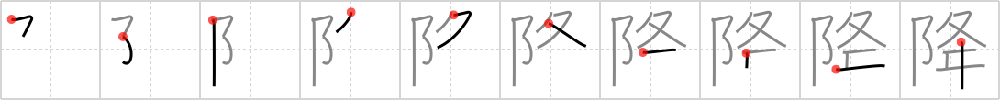

# {降}

## `descend`

## Strokes: 10

## Reading:

### On-Yomi: コウ、ゴ &mdash; Kun-Yomi: お.りる、お.ろす、ふ.る、ふ.り、くだ.る、くだ.す

### Examples: 降りる (お.りる), 降ろす (お.ろす), 降る (ふ.る)

## Words:

降ろす(おろす): to take down, to launch, to drop, to lower, to let (a person) off, to unload, to discharge

降水(こうすい): rainfall, precipitation

降伏(こうふく): capitulation, surrender, submission

以降(いこう): on and after, hereafter, thereafter

下降(かこう): downward, descent, fall, drop

降りる(おりる): get off, descend (e.g. a mountain)

降る(ふる): to precipitate, to fall (e.g. rain)
