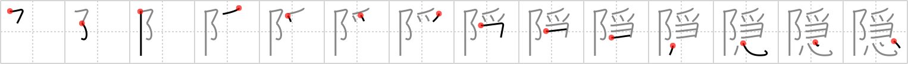

## {1313}

## `conceal`

## [14]

## Reading:

### On-Yomi: イン、オン &mdash; Kun-Yomi: かく.す、かく.し、かく.れる、かか.す、よ.る

### Examples: 隠す (かく.す), 隠れる (かく.れる)

## Words:

隠居(いんきょ): retirement, retired person

隠す(かくす): to hide, to conceal

隠れる(かくれる): hide, be hidden, conceal oneself, disappear
