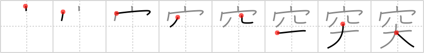

## `stab`

## [8]

## Reading:

### On-Yomi: トツ、カ &mdash; Kun-Yomi: つ.く

## Heisig V6:

Hole . . . St. Bernard dog.

## Koohii stories:

1) [<a href="http://kanji.koohii.com/profile/Raichu">Raichu</a>] 3-5-2006(269): When you<strong> stab</strong> something you often leave a big hole.

2) [<a href="http://kanji.koohii.com/profile/akrodha">akrodha</a>] 25-4-2007(55): The police have recruited a special breed of <em>St. Bernard</em> that can lick the wounds of a<strong> stab</strong>bing victim. The bleeding will stop instantly, saving the victim&#039;s life. One quirky side-effect, however, is that this treatment leaves behind a rather large hole...

3) [<a href="http://kanji.koohii.com/profile/dingomick">dingomick</a>] 3-1-2007(28): I<strong> stab</strong> your annoying <em>St. Bernard</em> and stare in shock at the giant black <em>hole</em> it leaves instead of a wound.

4) [<a href="http://kanji.koohii.com/profile/jameserb">jameserb</a>] 24-5-2008(18): There&#039;s a hole in that Saint Bernard -- somebody<strong> stab</strong>bed it.

5) [<a href="http://kanji.koohii.com/profile/andresito">andresito</a>] 14-5-2009(11): A big<strong> stab</strong> leaves a <em>big hole</em>.

6) [<a href="http://kanji.koohii.com/profile/kanjihito">kanjihito</a>] 26-11-2010(5): The<strong> stab</strong> left a big <em>hole</em> in the <em>Saint Bernard</em>. (don&#039;t confuse with <a href="../996">wound</a> (#996 傷).).

7) [<a href="http://kanji.koohii.com/profile/digicult">digicult</a>] 25-6-2009(5): I SO wanted to<strong> stab</strong> <em>Paris Hilton</em> but instead I decide to let my <em>St. Bernard</em> tear her to pieces, then it might look like an accident. Unfortunately, the <em>St. Bernard</em> got a little horny and they ended up, well.... <em>Paris Hilton</em> didn&#039;t mind at all, of course. I should have<strong> stab</strong>bed her instead. See this one in all its detail :S.

8) [<a href="http://kanji.koohii.com/profile/guidedog">guidedog</a>] 14-8-2007(5): Perfect illustration: Mark Haddon, The Curious Incident of the Dog in the Night-Time. When his neighbour&#039;s dog is<strong> stab</strong>bed to death the autistic 15-year-old narrator of the novel decides that he will take a page from Sherlock Holmes and track down the killer... Huge in the UK, this book is required reading for all the nerds at RTK.

9) [<a href="http://kanji.koohii.com/profile/sir_sanuk">sir_sanuk</a>] 18-1-2011(4): Riding my large <em>St. Bernard</em>, I terrorise the city,<strong> stab</strong>bing random <em>holes</em> everywhere I go.

10) [<a href="http://kanji.koohii.com/profile/elmaestrokgb">elmaestrokgb</a>] 27-10-2009(4): After I<strong> stab</strong>bed a guy in prison with a shiv, they put me in the &quot;<em>hole</em>&quot; for so long I believed deep DOWN I was a <em>St. Bernard</em>.
