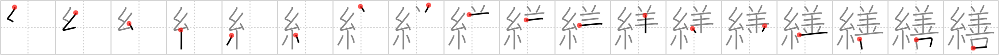

# {繕}

## `darning`

## Strokes: 18

## Reading:

### On-Yomi: ゼン &mdash; Kun-Yomi: つくろ.う

### Examples: 繕う (つくろ.う)

## Words:

繕う(つくろう): to mend, to repair, to fix, to patch up, to darn, to tidy up, to adjust, to trim

修繕(しゅうぜん): repair, mending
