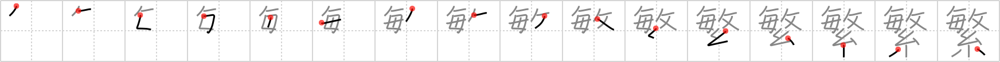

## {1337}

## `luxuriant`

## [16]

## Reading:

### On-Yomi: ハン &mdash; Kun-Yomi: しげ.る、しげ.く

## Words:

繁栄(はんえい): prospering, prosperity, thriving, flourishing

繁盛(はんじょう): prosperity, flourishing, thriving

繁殖(はんしょく): breed, multiply, increase, propagation

頻繁(ひんぱん): frequency
