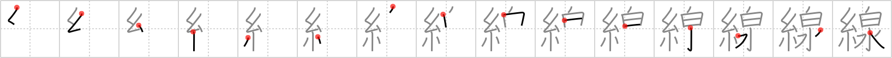

## `line`

## [15]

## Reading:

### On-Yomi: セン &mdash; Kun-Yomi: すじ

## Words:

沿線(えんせん): along railway line

幹線(かんせん): main line, trunk line

三味線(さみせん): three-stringed Japanese guitar, shamisen

点線(てんせん): dotted line, perforated line

電線(でんせん): electric line

無線(むせん): wireless, radio

下線(かせん): underline

曲線(きょくせん): curve

光線(こうせん): beam, light ray

新幹線(しんかんせん): bullet train

水平線(すいへいせん): horizon

線路(せんろ): line, track, roadbed

脱線(だっせん): derailment, digression

地平線(ちへいせん): horizon

直線(ちょくせん): straight line

内線(ないせん): phone extension, indoor wiring, inner line

線(せん): line

## Koohii stories:

1) [<a href="http://kanji.koohii.com/profile/jamestaverner">jamestaverner</a>] 15-2-2008(251): This kanji is used for train <strong>lines</strong>. <em>Spiderman</em> does a hot <em>spring</em> tour of Japan using the train <strong>lines</strong>. You can see the Spidey costume hanging on the washing <strong>line</strong> as he enjoys the onsen. 

2) [<a href="http://kanji.koohii.com/profile/Raichu">Raichu</a>] 11-7-2006(75): Japan&#039;s train<strong> line</strong>s are like threads that spring from Tokyo station. 

3) [<a href="http://kanji.koohii.com/profile/jamiemw">jamiemw</a>] 18-9-2007(38): Spiderman casts a<strong> line</strong> in order to get across a very hot srping. 

4) [<a href="http://kanji.koohii.com/profile/elmaestrokgb">elmaestrokgb</a>] 12-7-2009(33): <em>Spiderman</em> usually just travels by web, but when he goes to visit the hot <em>spring</em>, he has to take several train<strong> line</strong>s instead, since there are no buildings to swing from. [He tried swinging from power<strong> line</strong>s once--big mistake]. 

5) [<a href="http://kanji.koohii.com/profile/skyerise">skyerise</a>] 6-7-2010(7): On a vacation in Japan, SPIDER MAN waits in<strong> LINE</strong> to get in the hot SPRING. 

6) [<a href="http://kanji.koohii.com/profile/laner36">laner36</a>] 1-10-2007(7): At a hot spring for a photo shoot with a group of young kids, <em>Spiderman</em> tries to color a picture of a <em>spring</em>, but gets frustrated because he can&#039;t stay inside the<strong> line</strong>s. 

7) [<a href="http://kanji.koohii.com/profile/snallygaster">snallygaster</a>] 15-10-2007(6): Engineers are building a new train<strong> line</strong> to a popular <strong>spring</strong>. They want the tracks to be as straight as possible, so they check their<strong> line</strong>s with a length of <strong>thread</strong> pulled taut. 

8) [<a href="http://kanji.koohii.com/profile/cefreddffo">cefreddffo</a>] 27-9-2009(5): I just love the image contained in this ideogram: <strong>A<strong> line</strong> is a white thread of water</strong>.　RTK2:　セン　  <a href="http://jisho.org/kanji/details/線路">線路</a>  　せんろ(railroad tracks)…　Pure group:　  <a href="http://jisho.org/kanji/details/泉">泉</a>  133. 

9) [<a href="http://kanji.koohii.com/profile/KanjiVirtuoso">KanjiVirtuoso</a>] 1-8-2011(3): <em>Spiderman</em> takes advantage of a series of hot <em>springs</em> all arranged in a<strong> line</strong>, swinging from one to the next. 

10) [<a href="http://kanji.koohii.com/profile/Viking101">Viking101</a>] 8-1-2010(3): Spider-man does a<strong> line</strong> of cocaine while sitting in the <em>hot spring</em>. He gets so messed up that he reveals his true identity to Mary Jane. 
