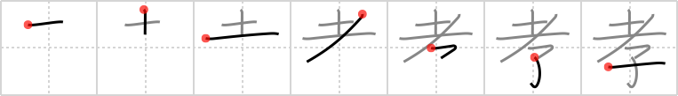

## `filial piety`

## [7]

## Reading:

### On-Yomi: コウ、キョウ

## Heisig story:

Old man . . . child.

## Koohii stories:

1) [<a href="http://kanji.koohii.com/profile/dilandau23">dilandau23</a>] 14-2-2007(317): This <em>child</em> has taken<strong> filial piety</strong> to the next level. He is actually carrying the <em>old man</em> on his shoulders.

2) [<a href="http://kanji.koohii.com/profile/vosmiura">vosmiura</a>] 9-11-2007(76): +dilandau23: This <em>child</em> has taken<strong> filial piety</strong> to the next level. He is actually carrying the <em>old man</em> on his shoulders. There is a picture of a statue depicting this here <a href="http://en.wikipedia.org/wiki/Filial_piety">http://en.wikipedia.org/wiki/Filial_piety</a>.

3) [<a href="http://kanji.koohii.com/profile/jabberwockychortles">jabberwockychortles</a>] 6-5-2009(11): In<strong> filial piety</strong>, the <em>child</em> looks up to the <em>old man</em>.

4) [<a href="http://kanji.koohii.com/profile/rgravina">rgravina</a>] 1-6-2006(6): <strong>Filial piety</strong> requires a <em>child</em> to look after their <em>old man</em> when he becomes a really <em>old man</em>.

5) [<a href="http://kanji.koohii.com/profile/lifeflaw">lifeflaw</a>] 16-3-2009(5): <strong>Hint:</strong> A picture depicting this Kanji at <a href="http://commons.wikimedia.org/wiki/index.html?curid=3957309">http://commons.wikimedia.org/wiki/index.html?curid=3957309</a>.

6) [<a href="http://kanji.koohii.com/profile/tritonxg">tritonxg</a>] 8-1-2010(4): [FR]piété filiale japlt:N1 <strong>KÔ</strong> k&amp;k 542 <em>grand-père(sol+slash)+enfant </em><strong>GHIRLANDAIO Domenico - Portrait d’un vieillard et d’un jeune garçon :</strong> image classique de la PIETE FILIALE que celle de ce GRAND-PERE et de cet ENFANT 孝敬 【こうけい】filial piety 孝女 【こうじょ】filial daughter 親不孝 【おやふこう】lack of<strong> filial piety</strong>不孝【ふこう】lack of<strong> filial piety</strong>.

7) [<a href="http://kanji.koohii.com/profile/sskaggs">sskaggs</a>] 20-9-2011(3): Confucius, the famous Chinese philosopher, had 5 pillars of virtue, the First and most important virtue being<strong> filial piety</strong>.<strong> Filial piety</strong> in confucian terms is defined as a <em>child&#039;s</em> respect and obedience to parents and the ancestor&#039;s, particularly the father, or the <em>old man.</em> Therefore,<strong> filial piety</strong> is defined as every <em>child&#039;s</em> respect for the <em>old man</em> above him.

8) [<a href="http://kanji.koohii.com/profile/Apple_Head">Apple_Head</a>] 3-10-2009(3): <em>John McCain&#039;s</em> daughter showed<strong> filial piety</strong> to him as a <em>child</em> by saying, &quot;I&#039;ll be a Republican too and make sure you get good health care as an <em>old man</em>!&quot;.

9) [<a href="http://kanji.koohii.com/profile/dtcamero">dtcamero</a>] 15-6-2010(2): Because of<strong> FILIAL PIETY</strong>, the <em>CHILD</em> puts the <em>OLD MAN</em>s needs above his own.

10) [<a href="http://kanji.koohii.com/profile/Tzadeck">Tzadeck</a>] 17-6-2009(2): This represents the two extremes in the hierarchical relationship of<strong> filial piety</strong>. The <em>old men</em> are at the top, and the <em>children</em> are at the bottom. The middle has been omitted for simplicity.

### {V4: 1253, V6: 1342}
