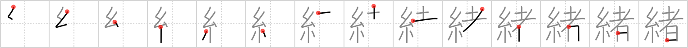

# {緒}

## Strokes: 14

## Reading:

### On-Yomi: ショ、チョ &mdash; Kun-Yomi: お、いとぐち

### Examples: 緒戦 (しょせん), 由緒 (ゆいしょ), 端緒 (たんしょ), 緒 (お)

## Words:

情緒(じょうしょ): emotion, feeling

一緒(いっしょ): together, meeting, company
