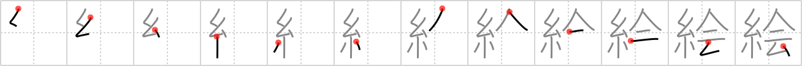

## `picture`

## [12]

## Reading:

### On-Yomi: カイ、エ

## Heisig story:

Thread . . . meeting.

## Koohii stories:

1) [<a href="http://kanji.koohii.com/profile/PacifistGod">PacifistGod</a>] 30-7-2007(368): There&#039;s never a<strong> picture</strong> of Spiderman meeting Peter Parker... I wonder why?

2) [<a href="http://kanji.koohii.com/profile/joesan">joesan</a>] 8-11-2007(51): Peter Parker&#039;s editor tells him &quot;Next time you have a <em>meeting</em> with <em>spiderman</em> take a goddamn<strong> picture</strong>, you&#039;re a photographer after all&quot;.

3) [<a href="http://kanji.koohii.com/profile/Nayelianne">Nayelianne</a>] 24-9-2008(26): A<strong> picture</strong> is just a matter of the harmonious <em>meeting</em> of lines. The many <em>threads</em> of a brush <em>meet</em> together on paper, finally forming a <strong>painting</strong>.

4) [<a href="http://kanji.koohii.com/profile/dukelexon">dukelexon</a>] 6-1-2008(13): By coercing fine, colorful <em>threads</em> to <em>meet</em> other threads in a needlepoint, it&#039;s entirely possible to create a very nice<strong> picture</strong>.

5) [<a href="http://kanji.koohii.com/profile/rucury">rucury</a>] 30-5-2013(12): A word of <strong>caution</strong>: This kanji&#039;s on-yomi is &quot;え”, and it&#039;s meaning is that of a <strong>picture</strong>, painting, drawing... However, it&#039;s not, strictly speaking, a photograph. The kanji for photograph is 写真 （しゃしん）「keyword 1: copy, 2: truth」. Try to remember this kanji without using the image of a photograph, to distinguish them further. The top two stories right now (by PacifistGod and joesan) sort of make you think of a photograph, so bear this in mind!

6) [<a href="http://kanji.koohii.com/profile/brian44">brian44</a>] 7-12-2007(11): Here we have some Thread and a Meeting of some sort to mean<strong> PICTURE</strong>. This can also have to do with paintings, which are another type of<strong> PICTURE</strong>. Anyways, imagine the Threads of the brush Meeting with the paper to create a<strong> PICTURE</strong>.

7) [<a href="http://kanji.koohii.com/profile/radical_tyro">radical_tyro</a>] 28-6-2007(5): <em>Black Widow</em> is bored at the superhero <em>meeting</em> so she&#039;s drawing a<strong> picture</strong> of everyone.

8) [<a href="http://kanji.koohii.com/profile/cosby">cosby</a>] 8-8-2009(4): The Bayeaux tapestry, a<strong> picture</strong> constructed of threads that depicts one of the most famous meetings in English history- The Battle of Hastings.

9) [<a href="http://kanji.koohii.com/profile/ayoung24">ayoung24</a>] 25-10-2007(4): Peter Parker is having a <em>meeting</em> with J. Jonah Jameson trying to sell him<strong> picture</strong>s of <em>spiderman</em>.

10) [<a href="http://kanji.koohii.com/profile/yunleinyo">yunleinyo</a>] 27-11-2009(3): There is a<strong> picture</strong> made by THREAD in the MEETING room.
