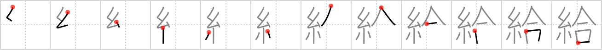

## {1349}

## `salary`

## [12]

## Reading:

### On-Yomi: キュウ &mdash; Kun-Yomi: たま.う、たも.う、-たま.え

## Words:

給仕(きゅうじ): office boy (girl), page, waiter

給食(きゅうしょく): school lunch, providing a meal

給う(たまう): to receive, to grant

配給(はいきゅう): distribution (eg. films rice)

補給(ほきゅう): supply, supplying, replenishment

給与(きゅうよ): allowance, grant, supply

給料(きゅうりょう): salary, wages

供給(きょうきゅう): supply, provisions

月給(げっきゅう): monthly salary

支給(しきゅう): payment, allowance
