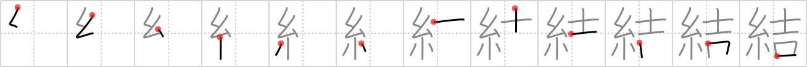

# {結}

## `tie`

## Strokes: 12

## Reading:

### On-Yomi: ケツ、ケチ &mdash; Kun-Yomi: むす.ぶ、ゆ.う、ゆ.わえる

### Examples: 結ぶ (むす.ぶ), 結う (ゆ.う), 結わえる (ゆ.わえる)

## Words:

結核(けっかく): tuberculosis, tubercule

結合(けつごう): combination, union

結晶(けっしょう): crystal, crystallization

結成(けっせい): formation

結束(けっそく): union, unity

妥結(だけつ): agreement

団結(だんけつ): unity, union, combination

結び(むすび): ending, conclusion, union

結び付き(むすびつき): connection, relation

結び付く(むすびつく): to be connected or related, to join together

結び付ける(むすびつける): to combine, to join, to tie on, to attach with a knot

結果(けっか): result, consequence

結局(けっきょく): after all, eventually

結論(けつろん): reason, sum up, conclude

結ぶ(むすぶ): tie, bind, link

結構(けっこう): splendid, nice, wonderful, delicious, sweet, construction, architecture, well enough, tolerably

結婚(けっこん): marriage
