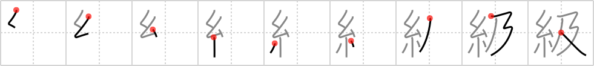

## {1353}

## `class`

## [9]

## Reading:

### On-Yomi: キュウ

## Words:

階級(かいきゅう): class, rank, grade

等級(とうきゅう): grade, class

同級(どうきゅう): the same grade, same class

学級(がっきゅう): grade in school

級(きゅう): class, grade, rank

高級(こうきゅう): high class, high grade

上級(じょうきゅう): advanced level, high grade, senior

初級(しょきゅう): elementary level
