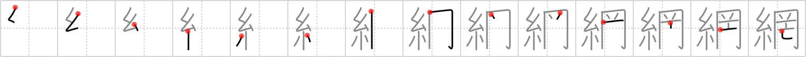

## `netting`

## [14]

## Reading:

### On-Yomi: モウ &mdash; Kun-Yomi: あみ

## Heisig story:

Thread . . . glass canopy . . . animal horns . . . perish.

## Koohii stories:

1) [<a href="http://kanji.koohii.com/profile/stehr">stehr</a>] 7-10-2007(188): <em>Spiderman</em> traps The Rhino under the <em>hood</em> of his famous<strong> netting</strong>, where even Rhino&#039;s <em>horns</em> can not break free, in fact if the<strong> netting</strong> did not dissappear after a few hours then Rhino might even <em>perish</em> in there.

2) [<a href="http://kanji.koohii.com/profile/Raichu">Raichu</a>] 29-10-2006(76): You use a 糸 to make a net shaped like a hood. A stray animal got caught in it by its horns and perished.

3) [<a href="http://kanji.koohii.com/profile/esaulgd">esaulgd</a>] 18-1-2008(54): Sadly, sometimes <strong>nettings</strong> have a <em>thread</em> so strong, the net gets caught like a <em>hood</em> on an animal&#039;s <em>horns</em>, and stays there until the poor thing <em>perishes</em>.

4) [<a href="http://kanji.koohii.com/profile/cbogart">cbogart</a>] 28-1-2007(26): Spider-woman dies of a mosquito bite. They replace the (ineffectual)<strong> netting</strong> over her bed with a glass canopy, and put a viking&#039;s horned helmet on her dead head, so she can lie in state with dignity.

5) [<a href="http://kanji.koohii.com/profile/tristanthorn">tristanthorn</a>] 14-4-2010(25): <em>Spiderman</em> caught The Rhino, under a <em>glass canopy</em>; instead of his usual webbed<strong> netting</strong>. But unfortunately, the <em>horned one perished</em>: he couldn&#039;t breathe. Next time spidey will stick to his traditional methods... (I prefer to say <em>horned one</em> rather than just <em>horned</em>, to remind myself of the extra stroke).

6) [<a href="http://kanji.koohii.com/profile/DavidZ">DavidZ</a>] 9-8-2011(10): This kanji is used for fish<strong>NET</strong> s<strong>T</strong>ock<strong>ING</strong>s ( 網タイツ ), made of <em>thread</em>, used by women to trap their prey as under a <em>hood.</em> The <em>horny</em> guy will then <em>perish</em> of &quot;the little death&quot;... 網羅的 [もうらてき] comprehensive, exhaustive.

7) [<a href="http://kanji.koohii.com/profile/kodorakun">kodorakun</a>] 15-7-2009(9): Note, most stories for this kanji SUCK. so i&#039;m taking a different approach: definition is &quot;net,<strong> netting</strong>, web&quot;. let&#039;s go with net/web: I followed thread after thread on the net, i was trapped in the glass screen (old CRT monitor) having a flame war with trolls (the horns), killing time.

8) [<a href="http://kanji.koohii.com/profile/Aikou">Aikou</a>] 3-9-2006(6): You know this one guy? Spiderman? He uses his spider threads to catch his enemies, right? Well this time he caught the devil himself with his horns in a huge net. Accidentially, he used so many threads the devil couldn&#039;t breathe anymore in his glass-canopy like (it doesn&#039;t break and well, you cannot breathe!!) prison and perished, gone forever!!

9) [<a href="http://kanji.koohii.com/profile/myglagata">myglagata</a>] 10-4-2009(5): <em>Spiderman</em> working in a garden center, throwing<strong> netting</strong> over the ordinary plants and putting a <em>glass jar</em> over the rare <em>horned</em> plants which are in danger of <em>perishing</em>.

10) [<a href="http://kanji.koohii.com/profile/komarunda">komarunda</a>] 2-11-2011(4): Hier sieht man, wie grausam Kinder sein können: Manche fangen Insekten - hier Hirschkäfer - mit einem <strong>Netz</strong> (das aus vielen <em>Fäden</em> besteht), stecken sie unter eine <em>Glasglocke</em> und sehen über die nächsten Tage munter dabei zu, wie die Tierchen mit ihren kleinen <em>Hörnern</em> darin <em>zugrunde gehen</em>.
