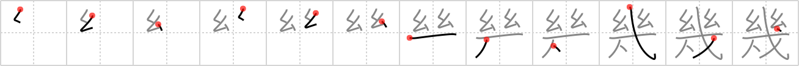

## {1381}

## `how many`

## [12]

## Reading:

### On-Yomi: キ &mdash; Kun-Yomi: いく-、いく.つ、いく.ら

### Examples: 幾 (いく)

## Words:

幾多(いくた): many, numerous

幾つ(いくつ): how many?, how old?

幾分(いくぶん): somewhat

幾ら(いくら): how much?, how many?
