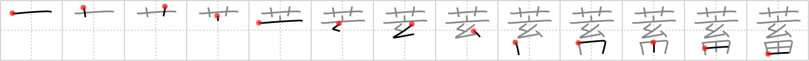

## {1385}

## `amass`

## [13]

## Reading:

### On-Yomi: チク &mdash; Kun-Yomi: たくわ.える

### Examples: 蓄える (たくわ.える)

## Words:

蓄積(ちくせき): accumulation, accumulate, store

貯蓄(ちょちく): savings

蓄える(たくわえる): to store
