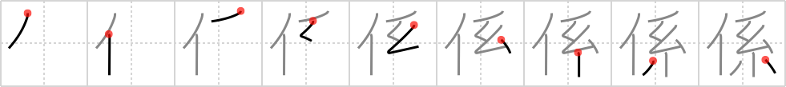

## {1392}

## `person in charge`

## [9]

## Reading:

### On-Yomi: ケイ &mdash; Kun-Yomi: かか.る、かかり、-がかり、かか.わる

### Examples: 係る (かか.る), 係 (かかり)

## Words:

係り(かかり): official, duty, person in charge

係わる(かかわる): concern oneself in, have to do with, affect, influence

関係(かんけい): relationship
