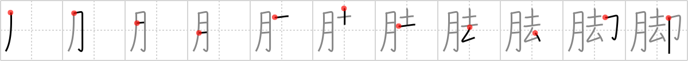

# {脚}

## Strokes: 11

## Reading:

### On-Yomi: キャク、キャ、カク &mdash; Kun-Yomi: あし

### Examples: 脚部 (きゃくぶ), 脚本 (きゃくほん), 三脚 (さんきゃく), 脚 (あし)

## Words:

脚色(きゃくしょく): dramatization (e.g. film)

脚本(きゃくほん): scenario
