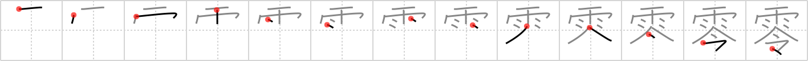

## {1402}

## `zero`

## [13]

## Reading:

### On-Yomi: レイ &mdash; Kun-Yomi: ぜろ、こぼ.す、こぼ.れる

## Words:

零す(こぼす): to spill

零れる(こぼれる): to overflow, to spill

零点(れいてん): zero, no marks

零(れい): zero, nought
