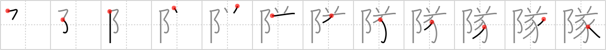

## `regiment`

## [12]

## Reading:

### On-Yomi: タイ

## Heisig story:

Pinnacle . . . animal horns . . . sow.

## Koohii stories:

1) [<a href="http://kanji.koohii.com/profile/dingomick">dingomick</a>] 2-1-2007(171): Every<strong> regiment</strong> of <em>The Pinnacle</em>&#039;s army is lead by a <em>Miss Piggy</em> with a <em>viking</em> helmet on.

2) [<a href="http://kanji.koohii.com/profile/Hinode">Hinode</a>] 11-2-2009(57): Every<strong> regiment</strong> of <em>The Pinnacle</em>&#039;s army has an animal name. This<strong> regiment</strong> is called &quot;<em>Horned Pig</em><strong> Regiment</strong>&quot;. They&#039;re wearing Wiking helms and are usually cowered in mud.

3) [<a href="http://kanji.koohii.com/profile/tomtosh">tomtosh</a>] 16-1-2008(22): As the only female in her police<strong> regiment</strong>, Officer <em>Pinnacle</em> often endures sexist remarks from the <em>horn</em>y male <em>pigs</em> she has to work with.

4) [<a href="http://kanji.koohii.com/profile/stupiddog">stupiddog</a>] 12-10-2009(13): After fleeing from <em>horny</em> <em>miss piggy</em> who tried to <a href="../v4/540">consummate</a> (#540 遂), Kermit is now sitting on the <em>pinnacle</em>. But not for long, because Miss Piggy and her <strong>regiment</strong> are launching their assault!

5) [<a href="http://kanji.koohii.com/profile/brian44">brian44</a>] 6-12-2007(7): Here we have a Pinnacle full of Horny Piggies to mean<strong> REGIMENT</strong>. Well, just the elements and shape give it away. The very lurid details that don’t need to be mentioned are always involved with<strong> REGIMENT</strong>S. They work very hard to get to the Pinnacle to get the high land and on the way, they act as though they are just Horny Piggies that rape and take away everything.

6) [<a href="http://kanji.koohii.com/profile/gavin.schultz-ohkubo">gavin.schultz-ohkubo</a>] 3-6-2010(6): <em>The Pinnacle</em> is guarded by a flying<strong> regiment</strong> of <em>horny pigs</em>.

7) [<a href="http://kanji.koohii.com/profile/jslindst">jslindst</a>] 19-3-2009(6): Napoleon <em>Bonaparte</em> had a special<strong> regiment</strong> of <em>horned pigs</em>. He&#039;d let them free in the heat of battle to confuse and totally throw the enemy off balance.

8) [<a href="http://kanji.koohii.com/profile/atylmo">atylmo</a>] 3-1-2009(6): <em>The Pinnacle</em>&#039;s top show on weekends is &quot;<em>Horny</em> <em>Miss Piggy</em>&quot;. The guys gather around the stage like an army<strong> regiment</strong> gathering an attack.

9) [<a href="http://kanji.koohii.com/profile/mekkanare">mekkanare</a>] 10-9-2011(3): The Government trained a<strong> REGIMENT</strong> of HORNED SOWS atop the PINNACLE. Operation Bacon.

10) [<a href="http://kanji.koohii.com/profile/robuta23">robuta23</a>] 22-3-2011(3): <em>Batman</em> faces a<strong> regiment</strong> of Joker&#039;s thugs, all wearing <em>pig</em> masks with <em>horns</em> on.
