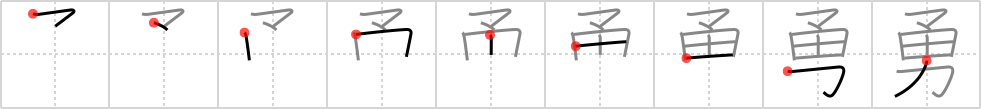

# {勇}

## Strokes: 9

## Reading:

### On-Yomi: ユウ &mdash; Kun-Yomi: いさ.む

### Examples: 勇む (いさ.む)

## Words:

勇敢(ゆうかん): bravery, heroism, gallantry

勇ましい(いさましい): brave, valiant, gallant, courageous

勇気(ゆうき): courage, bravery, valour, nerve, boldness
