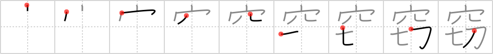

## `stealth`

## [9]

## Reading:

### On-Yomi: セツ &mdash; Kun-Yomi: ぬす.む、ひそ.か

## Heisig story:

Hole . . . cut.

## Koohii stories:

1) [<a href="http://kanji.koohii.com/profile/Raichu">Raichu</a>] 8-5-2006(184): This more commonly means &quot;steal&quot;, like how a thief <em>cuts</em> a <em>hole</em> to steal the jewels.

2) [<a href="http://kanji.koohii.com/profile/Howdoken">Howdoken</a>] 14-4-2008(97): The word<strong> STEALTH</strong> makes me instantly think of Solid Snake, who CUTS a HOLE in a cardboard box so he can peer out of it.

3) [<a href="http://kanji.koohii.com/profile/Katsuo">Katsuo</a>] 4-11-2007(66): <strong>Stealth</strong> bombers <em>cut holes</em> through the enemy radar.

4) [<a href="http://kanji.koohii.com/profile/herman">herman</a>] 16-11-2008(53): I picture a<strong> stealth</strong>y thief cutting a round hole in the glass window to quietly unlock it.

5) [<a href="http://kanji.koohii.com/profile/dihutenosa">dihutenosa</a>] 19-9-2007(11): The new<strong> stealth</strong> bomber being developed by the US government is insane. Instead of flying under radar or disrupting it, it simply bypasses the whole thing. It <em>cuts</em> a <em>black hole</em> just above it with its nose, then disappears into it. Then it travels invisibly and instantly to its destination, then <em>cuts</em> another <em>black hole</em> into the sky and reappears. Only trouble is that they have to make sure not to enter or exit somewhere important - or they&#039;ll suck the whole place into the <em>black hole</em>.

6) [<a href="http://kanji.koohii.com/profile/tritonxg">tritonxg</a>] 7-1-2010(8): [FR]dérober japlt:N1 <strong>SETSU nusu(mu)</strong> kanji&amp;kana:1717<em> trou+couper(sept+katana)</em> Pour venir DEROBER chez vous, les voleurs font un TROU dans la vitre et COUPENT les fils du téléphone et de l&#039;alarme 窃窃か 【ひそか】 secret; private;surreptitious 窃盗狂 【せっとうきょう】 kleptomaniac 窃盗罪 【せっとうざい】theft;stealing,larceny ひょう窃 【ひょうせつ】plagiarism;piracy 剽窃 【ひょうせつ】plagiarism; piracy.

7) [<a href="http://kanji.koohii.com/profile/jabberwockychortles">jabberwockychortles</a>] 3-2-2010(5): Shawshank Redemption, remember the prisoner&#039;s<strong> stealth</strong> when he <em>cut</em> a <em>hole</em> in the prison walls and eventually broke his way to freedom.

8) [<a href="http://kanji.koohii.com/profile/hugh2323">hugh2323</a>] 12-9-2012(4): WARNING: Don&#039;t use &#039;steal&#039; as the keyword here (as suggested in Raichu&#039;s story), as it is an upcoming keyword (1451). I made this mistake and now have to relearn this kanji.

9) [<a href="http://kanji.koohii.com/profile/mandu00">mandu00</a>] 3-2-2012(3): This more commonly means &quot;STEAL&quot;, like how a<strong> STEALTH</strong>y thief cuts a hole to steal the jewels. [adapted from Raichu].

10) [<a href="http://kanji.koohii.com/profile/Keiran_Halcyon">Keiran_Halcyon</a>] 2-3-2011(3): The ninja (or whatever thief you want to imagine) <em>cut</em>s a <em>hole</em> in the shoji screen, quietly slipping into the house.
