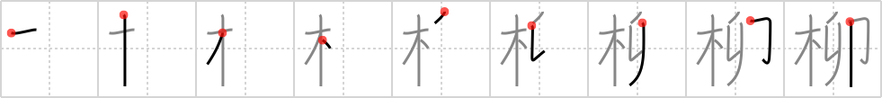

## `willow`

## [9]

## Reading:

### On-Yomi: リュウ &mdash; Kun-Yomi: やなぎ

### Examples: 柳 (やなぎ)

## Koohii stories:

1) [<a href="http://kanji.koohii.com/profile/happychair">happychair</a>] 6-3-2006(218): Having decided to use SIGN OF THE HARE rather than RECEIPT and STAMP my mnemonic goes as follows: The<strong> WILLOW</strong> is the TREE that droops likes a HARE&#039;s ears. 

2) [<a href="http://kanji.koohii.com/profile/wasurenaide">wasurenaide</a>] 14-12-2007(106): A strange thing about the japanese<strong> willow</strong> tree is, it grows eggs... but the eggs have no yokes. weird eh? 

3) [<a href="http://kanji.koohii.com/profile/Virtua_Leaf">Virtua_Leaf</a>] 5-1-2008(51): I ordered a<strong> willow</strong> <em>tree</em> off Amazon but when it arrived it was covered in postage <em>stamps</em>. I try to peel them off but it ends up leaving a papery mess and cheapifies the<strong> willow</strong>&#039;s appearance. Luckily I kept a <em>receipt</em>. 

4) [<a href="http://kanji.koohii.com/profile/taijuando">taijuando</a>] 16-5-2006(26): At the<strong> Willow</strong> Tree Nursery first you pick up your <em>tree</em> you can leave the lot when you show your <em>receipt</em> .. you also get a <em>stamp</em> for your next purchase. 

5) [<a href="http://kanji.koohii.com/profile/kfmfe04">kfmfe04</a>] 28-9-2008(15): A<strong> willow</strong> <em>tree</em> looks like it has <em>receipts</em> and <em>stamps</em> hanging off it. 

6) [<a href="http://kanji.koohii.com/profile/fuaburisu">fuaburisu</a>] 8-12-2007(15): There&#039;s a <em>tree</em> outside the local supermarket, where people like to hang their long <em>receipts</em>, it looks very much like a<strong> willow</strong>! There are many <em>stamps</em> scattered around the base of the <em>tree</em>, which look like fallen leaves. 

7) [<a href="http://kanji.koohii.com/profile/Gaignun">Gaignun</a>] 17-10-2010(12): The weeping<strong> willow</strong> weeps because its <em>tree</em> friends are being converted into paper for <em>receipts</em> and <em>stamps</em>. 

8) [<a href="http://kanji.koohii.com/profile/decals">decals</a>] 14-1-2009(8): There was a special mail-in offer with the<strong> willow</strong> tree I bought. You could send in your receipt, along with the correct postage(stamp), to receive your very own copy of<strong> Willow</strong>, THE MOVIE!!! (A great movie I might add.). 

9) [<a href="http://kanji.koohii.com/profile/daredawg3583">daredawg3583</a>] 27-5-2008(8): The <strong>Whomping<strong> Willow</strong></strong> from Harry Potter throwing eggs at everyone (be sure to take out the drops, cuz these eggs are solid and don&#039;t break, so the yoke doesn&#039;t come out!). 

10) [<a href="http://kanji.koohii.com/profile/Django">Django</a>] 25-11-2007(4): <strong>Willow</strong>, the charming little man with the big heart from the 1988 Ron Howard movie of the same name, like many in showbiz has grown increasingly worried that there is no <a href="../2041">sign of the hare</a> (#2041 <a href="http://jisho.org/kanji/details/卯">卯</a>). He is going around attaching to<strong> willow</strong> <em>trees</em> all around the area <em>receipts</em> and <em>stamps</em> bearing the hare&#039;s image. Help<strong> Willow</strong> find the hare! (see johnskb&#039;s story for <a href="../2041">sign of the hare</a> (#2041 <a href="http://jisho.org/kanji/details/卯">卯</a>)). 
