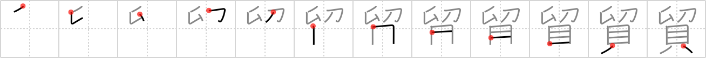

## `trade`

## [12]

## Reading:

### On-Yomi: ボウ

## Koohii stories:

1) [<a href="http://kanji.koohii.com/profile/akrodha">akrodha</a>] 3-5-2007(188): There&#039;s a buyback program where you can<strong> trade</strong> in your <em>dagger</em> for <em>money</em>. But it&#039;s quite ineffective, since only registered dagger-owners with the <em>original receipts</em> can participate, and not criminals with illegally-purchased daggers. 

2) [<a href="http://kanji.koohii.com/profile/Nukemarine">Nukemarine</a>] 8-11-2007(74): The new RANSOM note (a receipt stuck to a door with a dagger) from DETAIN (1423) appears again (probably after you went to the field as instructed) now gives instruction to<strong> TRADE</strong> the victim for CURRENCY you were told to bring. 

3) [<a href="http://kanji.koohii.com/profile/Proxx">Proxx</a>] 4-2-2008(51): Here is my <em>receipt</em> and here is my <em>dagger</em>. Now give me my <em>money</em> back! Isn&#039;t that a fair<strong> trade</strong>? 

4) [<a href="http://kanji.koohii.com/profile/andresito">andresito</a>] 17-5-2009(22): A fair<strong> trade</strong> means some <em>shells</em> (money) and a <em>receipt</em>. An unfair<strong> trade</strong> (robbery) means a <em>dagger</em> and no <em>receipt</em>. 

5) [<a href="http://kanji.koohii.com/profile/Ricardo">Ricardo</a>] 26-3-2007(12): [trade; exchange] The ancient tools-of-the-<strong>trade</strong> for trading are: <em>receipts</em>, <em>shells</em> and a <em>dagger</em> (to persuade a trading part that refuses to give the first or the second). 

6) [<a href="http://kanji.koohii.com/profile/FudoMyo">FudoMyo</a>] 15-3-2007(9): Hint: arms<strong> trade</strong>. 

7) [<a href="http://kanji.koohii.com/profile/j0k0m0">j0k0m0</a>] 23-1-2010(5): Got a receipt for that dagger, son? if yes, then I&#039;ll<strong> trade</strong> you some shells, and not detain   <a href="http://jisho.org/kanji/details/留">留</a>   you。 ぼうえきがいしゃ 【  <a href="http://jisho.org/kanji/details/貿易会社">貿易会社</a>  】trading company. 

8) [<a href="http://kanji.koohii.com/profile/scottamus">scottamus</a>] 3-8-2006(5): There was an amnesty program in England where people could<strong> trade</strong> in their illegal daggers and get some shells and a receipt. One person even brought in a Klingon Bat&#039;leth. (Real story is here: <a href="http://www.thesun.co.uk/article/0">http://www.thesun.co.uk/article/0</a>,,2-2006240126,00.html ). 

9) [<a href="http://kanji.koohii.com/profile/jonusbalonus">jonusbalonus</a>] 5-6-2013(3): The three cardinal rules of the drug<strong> trade</strong>: Never give a <em>receipt</em>. Always carry a <em>dagger</em>. Keep on top of the <em>money</em>. 

10) [<a href="http://kanji.koohii.com/profile/Kaame">Kaame</a>] 20-7-2012(3): If you still have the <em>receipt</em> you can<strong> trade</strong> in your <em>dagger</em> for <em>money</em>. 
