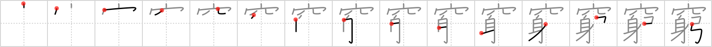

## `hard up`

## [15]

## Reading:

### On-Yomi: キュウ、キョウ &mdash; Kun-Yomi: きわ.める、きわ.まる、きわ.まり、きわ.み

## Heisig story:

Hole . . . somebody . . . bow.

## Koohii stories:

1) [<a href="http://kanji.koohii.com/profile/Raichu">Raichu</a>] 21-9-2006(165): <strong>Hard up</strong> = nothing but your body, living in a hole, with just a bow to hunt for your food.

2) [<a href="http://kanji.koohii.com/profile/dingomick">dingomick</a>] 28-8-2007(114): <strong>Somebody</strong> so <strong>hard up</strong> for cash, the volunteered to explore a <em>black hole</em> with nothing but a <em>bow</em>.

3) [<a href="http://kanji.koohii.com/profile/Nukemarine">Nukemarine</a>] 16-3-2008(54): Ok, picture a HOLE (well, more a pit trap) that SOMEBODY (well, a hunter with a BOW) just fell in. He&#039;s dangling over the HOLE holding onto his BOW across it. SOMEBODY finds it&#039;s HARD to get UP out of the HOLE. That great visual image should grant mastery of this kanji.

4) [<a href="http://kanji.koohii.com/profile/rgravina">rgravina</a>] 4-6-2006(25): With the research to plug up a <em>black hole</em> going nowhere and funding slashed, (see <a href="../v4/1320">research</a> (#1320 究)), the team can not afford to launch any more probes due to the high cost of the fuel. <em>Somebody</em>, probably one of the<strong> hard up</strong> scientists desperately in need of more funding, tries using a <em>bow</em> to shoot a probe into the centre of the <em>block hole</em> -- and funnily enough it succeeds!

5) [<a href="http://kanji.koohii.com/profile/aaronvanvalen">aaronvanvalen</a>] 19-5-2009(22): A girl is so<strong> hard up</strong> for cash she lets <em>somebody</em> use her <em>hole</em> with a <em>bow</em>, it&#039;s a fetish-thing I guess; makes the guy hard and up.

6) [<a href="http://kanji.koohii.com/profile/smithsonian">smithsonian</a>] 21-5-2007(12): Because they&#039;re so driven to put <em>holes</em> in people, the <em>gang members</em> are now using <em>bows</em>. They&#039;re too<strong> hard up</strong> to afford guns.

7) [<a href="http://kanji.koohii.com/profile/sir_sanuk">sir_sanuk</a>] 18-1-2011(11): <strong>Hard up</strong> = <em>Somebody</em> so broke they have to live in a <em>hole</em> with only a <em>bow</em> to catch food.

8) [<a href="http://kanji.koohii.com/profile/Perry">Perry</a>] 19-4-2010(6): If you are<strong> HARD UP</strong>, call Robin Hood. He will wait in a HOLE to ambush the SOMEBODY rich with his BOW and then give you something nice.

9) [<a href="http://kanji.koohii.com/profile/tomtosh">tomtosh</a>] 22-1-2009(5): <em>Dick Cheney</em> is so<strong> hard up</strong> since they took away his shotgun and he&#039;s forced to sit in a <em>hole</em> with Ted Nugent and <em>bow</em>hunt.

10) [<a href="http://kanji.koohii.com/profile/pjhoover">pjhoover</a>] 23-6-2008(4): The citizens of nottingham are<strong> hard up</strong> for cash, some of them even in the hole (in debt). somebody has to do something, who is that somebody robin hood!

### {V4: 1326, V6: 1424}
