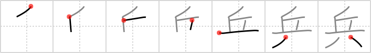

## `soldier`

## [7]

## Reading:

### On-Yomi: ヘイ、ヒョウ &mdash; Kun-Yomi: つわもの

## Heisig story:

Hill . . . animal legs.

## Koohii stories:

1) [<a href="http://kanji.koohii.com/profile/hirai">hirai</a>] 15-10-2007(265): Listen up<strong> soldier</strong>s! We&#039;re going to take that <em>hill</em>. You are no longer men with human legs. You are voracious animals, with <em>animal legs</em>! Got it? <em>Animal legs</em>! Now take that hill!

2) [<a href="http://kanji.koohii.com/profile/smithsonian">smithsonian</a>] 21-5-2007(73): The <em>hill</em> is so steep that you almost have to have <em>animal legs</em> to walk on it. However, the <strong>soldiers</strong> have no problem because they&#039;ve been trained to march there.

3) [<a href="http://kanji.koohii.com/profile/tk2000">tk2000</a>] 8-1-2007(36): Army ant <strong>soldiers</strong> climb up a <em>hill</em> with their mighty <em>animal</em> &quot;insect&quot; <em>legs</em> to battle the grasshoppers.

4) [<a href="http://kanji.koohii.com/profile/nishur">nishur</a>] 8-3-2009(34): <strong>Soldier</strong>s specially designed for combat in the <strong>hill</strong>s have got their lower body replaced by that of a mountain goat. Picture them hopping up the hills like silly little centaurs with their new <strong>animal legs</strong>!

5) [<a href="http://kanji.koohii.com/profile/LorenPaul">LorenPaul</a>] 23-7-2009(16): <strong>Soldier</strong>s use an axe as a tool of war!

6) [<a href="http://kanji.koohii.com/profile/SammyB">SammyB</a>] 20-8-2008(8): The army is breeding genetically modified<strong> soldier</strong>s with <em>animal legs</em> especially suited to <em>hill</em> warfare.

7) [<a href="http://kanji.koohii.com/profile/fuaburisu">fuaburisu</a>] 5-2-2006(7): Remember the <em>Faeries Hill</em> from two frames ago, where lumberjacks mysteriously disappeared ? Here the faeries are engineering half-human, half-animal<strong> soldier</strong>s to defend their Faery kingdom, by somehow grafting <em>animal legs</em> on the remains of those poor lumberjacks.

8) [<a href="http://kanji.koohii.com/profile/kodama">kodama</a>] 16-10-2007(6): A real<strong> soldier</strong> is one who can march up and down <em>eight hills</em>.

9) [<a href="http://kanji.koohii.com/profile/tritonxg">tritonxg</a>] 31-3-2010(5): [FR]<strong>soldat</strong> N2 <strong>HEI HYÔ </strong>k&amp;k:784<em> hache+établi</em> <strong>soldat d&#039;elite de la Légion Etrangère :</strong>les pionniers défilent en portant une HACHE et un tablier de cuir d&#039;ETABLI 兵 【つわもの】soldier 兵を挙げる 【へいをあげる】raise an army 兵舎 【いしゃ】barracks 兵式体操 【へいしきたいそう】military drill 傭兵 【ようへい】mercenary 衛兵 【えいへい】sentinel 米海兵隊 【べいかいへいたい】USMC 歩兵 【ふひょう】pawn 兵役 【へいえき】conscription.

10) [<a href="http://kanji.koohii.com/profile/mattimus">mattimus</a>] 19-10-2009(3): Imagine Gettysburg: a bunch of confederate<strong> soldier</strong>s let loose the rebel yell and scramble up a <em>hill</em> on all fours like <em>animal legs</em>.
