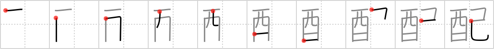

## `distribute`

## [10]

## Reading:

### On-Yomi: ハイ &mdash; Kun-Yomi: くば.る

### Examples: 配る (くば.る)

## Words:

気配(きはい): indication, market trend, worry

心配(しんぱい): worry, concern, anxiety, care

手配(てはい): arrangement, search (by police)

配給(はいきゅう): distribution (eg. films rice)

配偶者(はいぐうしゃ): spouse, wife, husband

配置(はいち): arrangement (of resources), disposition

配布(はいふ): distribution

配分(はいぶん): distribution, allotment

配慮(はいりょ): consideration, concern, forethought

配列(はいれつ): arrangement, array (programming)

分配(ぶんぱい): division, sharing

配る(くばる): deliver, distribute

気配(けはい): indication, market trend, worry

支配(しはい): rule, control, direction

配達(はいたつ): delivery, distribution

## Koohii stories:

1) [<a href="http://kanji.koohii.com/profile/happychair">happychair</a>] 14-3-2006(217): To<strong> DISTRIBUTE</strong> <em>WHISKY</em> during Prohibition you had to be as sneaky as a <em>SNAKE</em>. 

2) [<a href="http://kanji.koohii.com/profile/Tommy">Tommy</a>] 13-5-2008(140): In Japan, it&#039;s rude to<strong> distribute</strong> the <em>sake</em> to your <em>self</em> before anybody else. 

3) [<a href="http://kanji.koohii.com/profile/diracbracket">diracbracket</a>] 26-4-2011(37): Those who have studied physics may find this useful. The two parts of the kanji represent the two statistical <strong>distribution</strong>s for bosons and fermions. The Bose-Einstein <strong>distribution</strong> is represented by the <em>sign of the bird</em> because birds, like bosons, are social creatures who like to flock together. The Fermi-Dirac <strong>distribution</strong> is represented by a <em>snake</em>, since <em>snake</em>s, like fermions, are solitary creatures who like to keep to themselves. 

4) [<a href="http://kanji.koohii.com/profile/the_marshal">the_marshal</a>] 23-5-2006(31): Do a google search for &quot;Laotian Snake Whisky&quot;... yes snake whisky does exist !. Now you only have to found their distributor to get yourself a botle ! 

5) [<a href="http://kanji.koohii.com/profile/Shibo">Shibo</a>] 31-5-2008(14): Sir, you&#039;re under arrest for <strong>distributing</strong> <em>alcohol</em> to <em>snakes</em>. &quot;WHAT?? They told me they were worms!!&quot;. 

6) [<a href="http://kanji.koohii.com/profile/redskatz">redskatz</a>] 23-4-2009(9): I imagine a bartender serving <em>whiskey</em> to his patrons, and using that <em>snake</em>-like sprayer to <strong>distribute</strong> soda water into each glass. 

7) [<a href="http://kanji.koohii.com/profile/ruisu">ruisu</a>] 14-12-2007(7): One <em>whiskey</em> for you, <em>two</em> for me. Now that&#039;s what I call <em>self</em>-<strong>distribution</strong>. 

8) [<a href="http://kanji.koohii.com/profile/tritonxg">tritonxg</a>] 8-1-2010(5): [FR]distribution N2 <strong>HAI ku(baru)</strong> k&amp;k515 <em>alcool+serpent</em> depuis la prohibition l&#039;interdiction de <strong>DISTRIBUTION</strong> d&#039;ALCOOL est devenu un SERPENT de mer  <a href="http://jisho.org/kanji/details/配給系">配給系</a>  【はいきゅうけい】chain of <strong>distribution</strong>益配当【りえきはいとう】dividend  <a href="http://jisho.org/kanji/details/伉配">伉配</a>  【こうはい】married couple  <a href="http://jisho.org/kanji/details/植民地支配">植民地支配</a>  【しょくみんちしはい】colonial rule  <a href="http://jisho.org/kanji/details/指名手配人">指名手配人</a>  【しめいてはいじん】wanted criminal  <a href="http://jisho.org/kanji/details/配流">配流</a>  【はいる】banishment  <a href="http://jisho.org/kanji/details/宅配">宅配</a>  【たくはい】home deliver. 

9) [<a href="http://kanji.koohii.com/profile/Tzadeck">Tzadeck</a>] 21-7-2009(5): <em>Bottles of whiskey</em> with <em>snakes</em> in them are only <strong>distrubuted</strong> in certain countries--it&#039;s illegal in places like the United States. 

10) [<a href="http://kanji.koohii.com/profile/aodeur">aodeur</a>] 1-5-2011(3): <em>Schlangenschnaps</em> ist im fernen Osten sehr beliebt. In den großen Flaschen befindet sich neben dem <em>Alkohol</em> tatsächlich auch eine <em>Schlange</em>. Problematisch ist jedoch das <strong>Zuteilen</strong> von gerechten Portionen für jeden, weil es so schwer ist, die Schlange in gleichwertige Teile <strong>zu teilen</strong>... 
