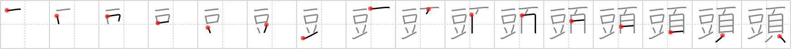

## `head`

## [16]

## Reading:

### On-Yomi: トウ、ズ、ト &mdash; Kun-Yomi: あたま、かしら、-がしら、かぶり

### Examples: 頭部 (とうぶ), 年頭 (ねんとう), 船頭 (せんどう), 頭脳 (ずのう), 頭上 (ずじょう), 頭痛 (ずつう), 頭 (あたま), 頭 (かしら)

## Words:

街頭(がいとう): in the street

口頭(こうとう): oral

冒頭(ぼうとう): beginning, start, outset

頭痛(ずつう): headache

頭脳(ずのう): head, brains, intellect

先頭(せんとう): head, lead, vanguard, first

頭(あたま): head

## Koohii stories:

1) [<a href="http://kanji.koohii.com/profile/blackstockc">blackstockc</a>] 17-2-2008(215): The<strong> head</strong> of the family sits at the<strong> head</strong> of the <em>table</em>. 

2) [<a href="http://kanji.koohii.com/profile/cameron_en">cameron_en</a>] 25-10-2008(87): <em>Mr. Bean</em> has a funny <strong><em>head</em></strong>. 

3) [<a href="http://kanji.koohii.com/profile/Spidercat">Spidercat</a>] 3-3-2008(51): Mr <em>Bean</em>&#039;s <em>head</em>. 

4) [<a href="http://kanji.koohii.com/profile/CharleyGarrett">CharleyGarrett</a>] 20-12-2006(21): Which one is the <strong>head</strong> <em>table</em>? Well, it&#039;s the <em>table</em> with the <strong><em>head</em></strong> sitting beside it, isn&#039;t it? 

5) [<a href="http://kanji.koohii.com/profile/decamer0n">decamer0n</a>] 14-6-2007(11): Sometimes old men refer to your<strong> head</strong> as your noggin, your noodle, or your <em>bean</em>. 

6) [<a href="http://kanji.koohii.com/profile/sindhikara">sindhikara</a>] 4-1-2009(9): <em>Mr. Bean&#039;s</em> <em>head</em> is not always where it should be. (It&#039;s next to him, not on top!). 

7) [<a href="http://kanji.koohii.com/profile/thecite">thecite</a>] 10-6-2009(7): After being used as a primitive in so many kanji, the<strong> head</strong> smacks itself down on the table in exhaustion. 

8) [<a href="http://kanji.koohii.com/profile/FoxintheStars">FoxintheStars</a>] 15-2-2011(6): An especially remarkable<strong> head</strong> is that of Anpanman---he has <em>bean</em> paste in his <em>head</em>, as Japanese children know (<a href="http://en.wikipedia.org/wiki/Anpanman">http://en.wikipedia.org/wiki/Anpanman</a>). 

9) [<a href="http://kanji.koohii.com/profile/delbertmon">delbertmon</a>] 5-1-2010(6): Mr <em>Bean</em>&#039;s <em>head</em>. (thanks Spidercat) <a href="http://adminsecret.monster.com/nfs/adminsecret/photos/0000/5533/mr-bean_max600.jpg">http://adminsecret.monster.com/nfs/adminsecret/photos/0000/5533/mr-bean_max600.jpg</a>. 

10) [<a href="http://kanji.koohii.com/profile/Cheesemaster64">Cheesemaster64</a>] 11-6-2009(6): Smash your<strong> head</strong> into the table over and over until you remember this kanji. Go ahead. I&#039;m waiting. ACTUALLY I&#039;m sorry, slam the <em>table</em> into your <em>head</em> over and over until you remember this kanji. 
