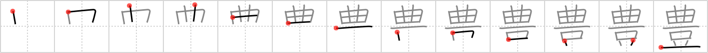

# {豊}

## `bountiful`

## Strokes: 13

## Reading:

### On-Yomi: ホウ、ブ &mdash; Kun-Yomi: ゆた.か、とよ

### Examples: 豊 (ゆたか)

## Words:

豊作(ほうさく): abundant harvest, bumper crop

豊富(ほうふ): abundance, wealth, plenty, bounty

豊か(ゆたか): abundant, wealthy, plentiful, rich
