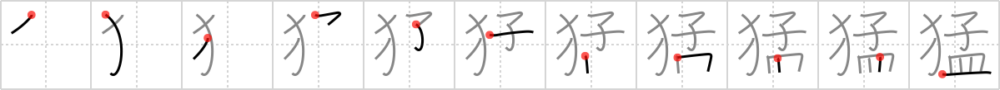

## `fierce`

## [11]

## Reading:

### On-Yomi: モウ

## Koohii stories:

1) [<a href="http://kanji.koohii.com/profile/richcoop">richcoop</a>] 28-6-2009(291): The<strong> fierce</strong> WILD DOG attacked the CHILD who came near his feeding DISH. 

2) [<a href="http://kanji.koohii.com/profile/decals">decals</a>] 16-1-2009(44): I picture a<strong> fierce</strong> little fat kid, defending his dish of food from a pack of dogs. 

3) [<a href="http://kanji.koohii.com/profile/teiohx2">teiohx2</a>] 31-7-2007(31): If you want to make your wild dogs<strong> fierce</strong>, feed them a child. Children are the holy grail of dogfood you know... 

4) [<a href="http://kanji.koohii.com/profile/jaresty">jaresty</a>] 16-11-2007(28): If you want to make your wild dogs<strong> fierce</strong>, put a child in their dish. 

5) [<a href="http://kanji.koohii.com/profile/Nukemarine">Nukemarine</a>] 8-10-2007(13): Ok, I&#039;ll bring in a 300 reference. A<strong> FIERCE</strong> pack of WILD DOGS fight an even<strong> FIERCE</strong>R spartan CHILD over the food left on the PLATE. The CHILD won and was declared king. 

6) [<a href="http://kanji.koohii.com/profile/jabberwockychortles">jabberwockychortles</a>] 2-4-2010(5): The<strong> fierce</strong> <em>pack of wild dogs</em> found the <em>child</em> to be a savory <em>dish</em>. 

7) [<a href="http://kanji.koohii.com/profile/Fluhk">Fluhk</a>] 28-6-2006(5): What we see here is a<strong> FIERCE</strong> attack by WILD DOGS, serving themselves to a special DISH of CHILD meat... 

8) [<a href="http://kanji.koohii.com/profile/uberclimber">uberclimber</a>] 10-2-2011(4): The<strong> fierce</strong> <em>wild dog</em> attacked the <em>child</em> who came near his feeding <em>dish</em>. (Of course, this begs the question of why a <em>wild</em> dog has a feeding dish.)   <a href="http://jisho.org/kanji/details/猛烈">猛烈</a>   (もうれつ) : violent, vehement, rage;   <a href="http://jisho.org/kanji/details/猛犬">猛犬</a>   もうけん &quot;Beware of the Dog!&quot;. 

9) [<a href="http://kanji.koohii.com/profile/gavmck">gavmck</a>] 21-12-2009(4): The campers were attacked by a<strong> fierce</strong> <em>pack of dogs</em>. One quick thinking <em>child</em> drove them away by using dinner <em>plates</em> as frisbees. 

10) [<a href="http://kanji.koohii.com/profile/synewave">synewave</a>] 1-3-2007(4): &quot;A dingo ate my baby!&quot; - if you know this line maybe it works for you too. 
