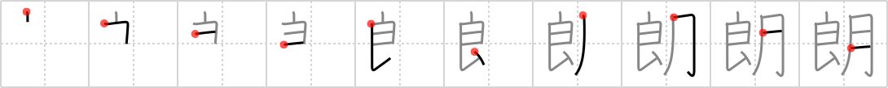

# {朗}

## Strokes: 10

## Reading:

### On-Yomi: ロウ &mdash; Kun-Yomi: ほが.らか、あき.らか

### Examples: 朗らか (ほが.らか)

## Words:

明朗(めいろう): bright, clear, cheerful

朗読(ろうどく): reading aloud, recitation

朗らか(ほがらか): brightness, cheerfulness, melodious
