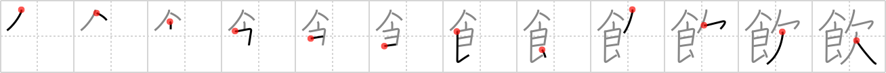

# {飲}

## Strokes: 12

## Reading:

### On-Yomi: イン、オン &mdash; Kun-Yomi: の.む、-の.み

### Examples: 飲む (の.む)

## Words:

飲み込む(のみこむ): to gulp down, to swallow deeply, to understand, to take in, to catch on to, to learn, to digest

湯飲み(ゆのみ): teacup

飲み物(のみもの): drink, beverage

飲む(のむ): to drink
