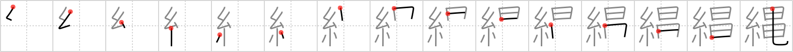

## `straw rope`

## [15]

## Reading:

### On-Yomi: ジョウ &mdash; Kun-Yomi: なわ、ただ.す

## Heisig story:

Thread . . . eels.

## Premitive:

cocoon X The two triangular shapes here and their final stroke are intended as a pictograph of a cocoon, spun in circles and tied up at the end. It is like the character for thread, except that the silkworm’s actual product has not yet emerged clearly at the bottom. [3]

## Koohii stories:

1) [<a href="http://kanji.koohii.com/profile/Stormchild">Stormchild</a>] 5-9-2006(200): The tortoise has escaped! We tied it up with a<strong> straw rope</strong>, but all that&#039;s left of the rope are some torn <em>threads</em>, and the <em>unbound tortoise</em> is nowhere to be found. (Note that the right half here is not &quot;eels&quot;. This is (in my opinion) a mistake in the RTK book, as we already decided in <a href="../v4/537">waterfall</a> (#537 滝) to refer to the simplified form of dragon as &quot;eels&quot;. It is much better to call the right half of this character an &quot;unbound tortoise&quot;.).

2) [<a href="http://kanji.koohii.com/profile/Zactacular">Zactacular</a>] 28-9-2007(145): When <em>Spiderman</em> fights the giant <em>tortoise</em>, he grabs a<strong> straw rope</strong> from the edges of the sumo ring and swings it at his head. However, the <em>tortoise</em> quickly tucks his head back into his shell to avoid the blow (hence no head on the <em>tortoise</em>).

3) [<a href="http://kanji.koohii.com/profile/Matthew">Matthew</a>] 2-4-2007(30): A<strong> straw rope</strong> is made from <em>threads</em> and has about the thickness of an <em>eel</em>.

4) [<a href="http://kanji.koohii.com/profile/mantixen">mantixen</a>] 22-9-2008(21): Our friendly neighborhood <em>Spider-Man</em> takes off the<strong> straw rope</strong> that was <em>binding</em> the <em>tortoise</em>.

5) [<a href="http://kanji.koohii.com/profile/akrodha">akrodha</a>] 14-4-2008(13): <em>Spiderman&#039;s</em> threads conduct electricity a bit too well, so when he has to bind up <em>electric eels</em>, he just buys some<strong> straw rope</strong> at the post office and shoots it out of his arm. Ouch, that stuff sure leaves a rash.

6) [<a href="http://kanji.koohii.com/profile/smithsonian">smithsonian</a>] 4-7-2007(12): If you need some sort of <em>string</em> to tie up a <em>couple of eels</em>, I suggest something that doesn&#039;t conduct electricity, like a<strong> straw rope</strong>.

7) [<a href="http://kanji.koohii.com/profile/wazato">wazato</a>] 6-3-2010(6): なわ！We learned the kanji for shibari (Japanese rope bondage) in the last frame and the kanji for rope, 縄 なわ, in this. Spiderman engages in some shibari with a hot acupuncturist. Not only does he use special eel-glossed rope, but also acupuncturist needles to add some extra spice to the encounter.

8) [<a href="http://kanji.koohii.com/profile/endote">endote</a>] 30-9-2010(5): The best thread to use to catch a turtle from Okinawa is a<strong> straw rope</strong>.

9) [<a href="http://kanji.koohii.com/profile/slats70">slats70</a>] 19-12-2008(5): <em>Spiderman</em> loves the rodeo, however he prefers to partake in a more extreme version. He goes out to sea and try&#039;s to lassoo giant <em>turtles</em> with his<strong> straw rope</strong> which are extremely hard to catch as they tuck their head just in time. (Inspired by Zactacular).

10) [<a href="http://kanji.koohii.com/profile/swiftman">swiftman</a>] 30-7-2009(4): <em>Spider-Man</em> used a<strong> straw rope</strong> to tie up the <em>unbound tortoise</em>. (Note that the right half here is not &quot;eels&quot;. This is (in my opinion) a mistake in the RTK book, as we already decided in waterfall (FRAME 537) to refer to the simplified form of dragon as &quot;eels&quot;. It is much better to call the right half of this character an &quot;unbound tortoise&quot;.) courtesy Stormchild.
