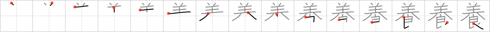

## `foster`

## [15]

## Reading:

### On-Yomi: ヨウ、リョウ &mdash; Kun-Yomi: やしな.う

## Koohii stories:

1) [<a href="http://kanji.koohii.com/profile/nolusu">nolusu</a>] 25-8-2007(162): A sheep became the<strong> foster</strong> parent for a wolf pup, feeding it with milk. This story cannot end well... 

2) [<a href="http://kanji.koohii.com/profile/akotkav">akotkav</a>] 9-5-2006(117): You<strong> foster</strong> (&quot;promote the growth of&quot;) your sheep well when they have food right at their feet. 

3) [<a href="http://kanji.koohii.com/profile/PepeSeco">PepeSeco</a>] 21-4-2008(103): Judy<strong> Foster</strong> in &quot;The Silence of the <em>Lamb</em>s&quot; is what Dr. Hannibal-the cannibal-Lecter would like to <em>eat</em>. 

4) [<a href="http://kanji.koohii.com/profile/uberstuber">uberstuber</a>] 6-6-2007(44): <strong>Foster</strong> a <em>sheep</em> today! Rule 1: don&#039;t <em>eat</em> your new <em>sheep</em>. 

5) [<a href="http://kanji.koohii.com/profile/delbertmon">delbertmon</a>] 6-1-2010(34): You<strong> foster</strong> a sheep so you can eat it later. 

6) [<a href="http://kanji.koohii.com/profile/Nisshawn">Nisshawn</a>] 16-11-2009(13): Sheeps not only nurture (the other meaning) their own lambs but they also<strong> foster</strong> other sheeps lambs as they all get mixed up in the group. One this is for certain, the lambs always know where to find the <em>food</em> - under the <em>sheeps</em> legs. 

7) [<a href="http://kanji.koohii.com/profile/Corodon">Corodon</a>] 23-1-2009(8): Tired of lagging behind beef in sales, the mutton industry launches an ad campaign to <strong>foster</strong> awareness that <em>sheep</em> are <em>food</em> too. &quot;Got sheep?&quot; &quot;Lamb, the other red meat&quot; &quot;Mutton, it&#039;s what&#039;s for dinner&quot;. I just wish these guys would be more original with their slogans. 

8) [<a href="http://kanji.koohii.com/profile/TheSlakey">TheSlakey</a>] 25-12-2008(4): Double meaning: if you want to<strong> foster</strong> the development of the sheep you need to give them good food. The Dao says that just like the sheep, in order to<strong> foster</strong> docile human sheep, you should keep their bellies full but not their minds. 

9) [<a href="http://kanji.koohii.com/profile/penot">penot</a>] 2-12-2008(4): <strong>Foster</strong> the <em><strong>sheep</strong></em> to give you <em><strong>food</strong></em>. // For &#039;  <a href="http://jisho.org/kanji/details/羊">羊</a>  &#039; Pronounciation Rules, see <a href="../547">sheep</a> (#547 <a href="http://jisho.org/kanji/details/羊">羊</a>) // ヨウ やしな·う yang3 양 (yang). 

10) [<a href="http://kanji.koohii.com/profile/Artur83">Artur83</a>] 14-9-2009(3): (<strong>German</strong>) Die mongolischen Reiterhorden <strong>ernähren</strong> sich von ihren <em>Schafsherden</em>. Aber es ist gar nicht so leicht, in dem kargen Land <em>Essen</em> für die Tiere zu finden. 
