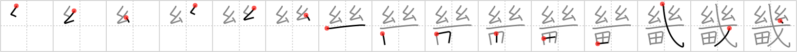

## `capital suburbs`

## [15]

## Reading:

### On-Yomi: キ &mdash; Kun-Yomi: みやこ

## Heisig story:

Two cocoons . . . field . . . fiesta.

## Koohii stories:

1) [<a href="http://kanji.koohii.com/profile/mantixen">mantixen</a>] 31-7-2009(78): People aside, I wonder <em>how many rice fields</em> there are in the<strong> capital suburbs</strong>.

2) [<a href="http://kanji.koohii.com/profile/Neobeo">Neobeo</a>] 22-1-2009(14): <em>How many brains</em> does it take to run the<strong> capital suburbs</strong>?

3) [<a href="http://kanji.koohii.com/profile/einahpets">einahpets</a>] 28-2-2012(8): This keyword refers to Japan&#039;s Kinki Region, a historic name for present-day Kansai. 近畿 きんき Just <em>how many rice fields</em> are in the<strong> capital suburbs</strong>? (The kinky (Kinki) <em>people</em> are hidden in the fields so you can&#039;t see them).

4) [<a href="http://kanji.koohii.com/profile/sulris">sulris</a>] 18-4-2011(8): The<strong> capital suburbs</strong> were the five areas that around the kyoto nara osaka area that were under direct imperial rule (not ruled by the feudal lords) (the capital being first nara then kyoto) in this time the most important thing was how many rice fields you had. and as the area grew in the large cities that emporer had less and less rice fields (the latter half is not true).

5) [<a href="http://kanji.koohii.com/profile/Katsuo">Katsuo</a>] 14-10-2007(5): While exploring the capital you come across a <em>cocoon fiesta</em> being held in a <em>paddyfield</em>. &quot;There&#039;s no space for this kind of thing in the city centre, we must be in the<strong> capital suburbs</strong>,&quot; you think.

6) [<a href="http://kanji.koohii.com/profile/Gaignun">Gaignun</a>] 23-4-2011(2): This keyword refers to Japan&#039;s <strong>Kinki Region</strong>, a historic name for present-day Kansai. In those days, <em>how many</em> <em>rice fields</em> a feudal lord owned in the <strong>suburbs</strong> was a measure of worth. Now, with the industrialised cities of Kobe and Osaka having grown, there are much fewer rice fields to be seen.

7) [<a href="http://kanji.koohii.com/profile/kapalama">kapalama</a>] 29-10-2010(2): 近畿 , 畿内 , 五畿内 <a href="../v4/2887">capital suburbs</a> (#2887 畿) キ( 幾 ) ... Parts: 幾 - 人 , 田 (cf. 幾つ <a href="../v4/1381">how many</a> (#1381 幾), 機械 <a href="../v4/1382">mechanism</a> (#1382 機), 磯辺 <a href="../v4/2594">rocky beach</a> (#2594 磯) ... Keyword note: In modern Japanese this <strong>Kinki</strong>, the area around Kyoto, now largely means the same as Kansai. ... Story: <strong>Kinki</strong> Kids are from the (old)<strong> Capital Suburbs</strong>, or the area around Kyoto. It&#039;s the <em>How Many</em> <em>Rice Fields</em>, <em>not people</em> that matter to this area. Tokyo may be bigger in population, but Osaka is &quot;Japan&#039;s kitchen&quot;.

8) [<a href="http://kanji.koohii.com/profile/kiwiburner">kiwiburner</a>] 1-2-2013(1): The<strong> capital suburbs</strong> were drawn up based on <em>how many</em> (on an <em>abacus</em>) <em>rice fields</em> there were in each area. Never heard of <em>Gotanda</em>?

9) [<a href="http://kanji.koohii.com/profile/kanjihito">kanjihito</a>] 10-1-2012(1): People aside, I wonder <em>how many</em> inanimate <em>brains</em> there really are in the<strong> capital suburbs</strong>.

10) [<a href="http://kanji.koohii.com/profile/gfb345">gfb345</a>] 3-6-2010(1): (Continued from my story for <a href="../v4/1381">how many</a> (#1381 幾)). The capital&#039;s government needs to find out the population of the <strong>CAPITAL SUBURBS</strong>, and engages the services of the <em>COUNTING COCOON-GOONS</em>, who performed so well in 幾 <a href="../v4/1381">how many</a> (#1381 幾). They basically follow the same formula: they set up a massive <em>FIESTA</em> to draw the suburbanites away from their <em>RICE FIELD</em>s, and in this way count them.

### {V4: 2887, V6: 1483}
