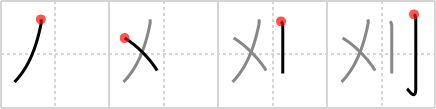

## `reap`

## [4]

## Reading:

### On-Yomi: ガイ、カイ &mdash; Kun-Yomi: か.る

## Koohii stories:

1) [<a href="http://kanji.koohii.com/profile/scottamus">scottamus</a>] 12-6-2006(180): Sheaf? No. This is the sign of the X-Men. I&#039;m going with Wolverine on this one.. Wolverine<strong> reap</strong>s the bad guys with his saber-like claws. 

2) [<a href="http://kanji.koohii.com/profile/johnskb">johnskb</a>] 18-4-2006(79): A SABRE is used to cut the stalks of plants being<strong> REAP</strong>ED at harvest. They are then combined into a SHEAF. 

3) [<a href="http://kanji.koohii.com/profile/mantixen">mantixen</a>] 26-9-2008(28): You<strong> reap</strong> what you sow, so sow plenty and<strong> reap</strong> a lot to have a メリ Christmas! 

4) [<a href="http://kanji.koohii.com/profile/squeaky_lill_mk">squeaky_lill_mk</a>] 26-8-2010(17): New primitive: Death, the Discworld&#039;s Grim<strong> Reap</strong>er: <a href="http://en.wikipedia.org/wiki/Death_">http://en.wikipedia.org/wiki/Death_</a>(Discworld) for <a href="../1489">hope</a> (#1489 <a href="http://jisho.org/kanji/details/希">希</a>), <a href="../1490">villain</a> (#1490 <a href="http://jisho.org/kanji/details/凶">凶</a>), <a href="../1493">kill</a> (#1493 <a href="http://jisho.org/kanji/details/殺">殺</a>), <a href="../1696">ward</a> (#1696 <a href="http://jisho.org/kanji/details/区">区</a>) The X is the movement of the<strong> Reap</strong>er&#039;s sword. <em>Death</em> uses his <em>sword</em> to<strong> reap</strong> some lives, as in this video: <a href="http://www.youtube.com/watch?v=oJ_0z_a0LI0">http://www.youtube.com/watch?v=oJ_0z_a0LI0</a> (starting from 03:40). 

5) [<a href="http://kanji.koohii.com/profile/Raichu">Raichu</a>] 19-9-2006(11): <em>X</em> marks the spot where you sweep your <em>blade</em> to<strong> reap</strong> the harvest. 

6) [<a href="http://kanji.koohii.com/profile/synewave">synewave</a>] 10-4-2007(8): You<strong> reap</strong> what you sow. Here I see an ア<strong>メ</strong>リカン farmer cutting <em>sheafs</em> with his <em>sabre</em>. 

7) [<a href="http://kanji.koohii.com/profile/Harrow">Harrow</a>] 1-3-2009(7): Kenshin, who has an X on his face, is Samurai X. He did the work of the Grim <strong>Reap</strong>er in his previous occupation as a skilled assassin. 

8) [<a href="http://kanji.koohii.com/profile/sabretou">sabretou</a>] 8-3-2011(5): メリ had a little lamb, whose fleece was white as snow. And everywhere that メリ went, the lamb was sure to go. メリ&#039;s time had come one day, come one day, come one day, And when the <strong>Reap</strong>er came for her, came for her, came for her, And when the <strong>Reap</strong>er came for her, The poor f.in&#039; lamb got <strong>reaped</strong> with her. 

9) [<a href="http://kanji.koohii.com/profile/Meconium">Meconium</a>] 19-5-2009(5): Hint: sheaf = Mulder and Scully from the X-files. <em>Mulder and Scully</em> are hacking through a cornfield with machetes. &quot;Hey Scully, look at us with our <em>sabres</em>, we&#039;re like the Grim<strong> Reap</strong>er!&quot; &quot;Oh Mulder, you know that stereotypical Western European ecclesiastical iconism depicts the Grim<strong> Reap</strong>er with a scythe, not a machete!&quot; &quot;A machete is an established form of <em>sabre</em>, Scully, and we&#039;re<strong> reap</strong>ing this corn field like it&#039;s souls!&quot; &quot;Oh, Mulder...&quot;. 

10) [<a href="http://kanji.koohii.com/profile/shuusaku">shuusaku</a>] 10-3-2010(4): To<strong> REAP</strong> the SHEAF use your SABER! 
