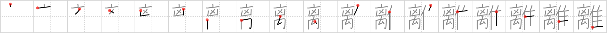

## `detach`

## [18]

## Reading:

### On-Yomi: リ &mdash; Kun-Yomi: はな.れる、はな.す

## Heisig story:

<i>Top hat</i> . . . <i>villain</i> . . . <i>belt</i> . . . <i>elbow</i> . . . <i>turkey</i>. This is potentially one of the most difficult characters to remember. Tackle it positively and let the image &quot;sink in&quot; by carrying it around with you today and calling it up in your spare moments.

## Koohii stories:

1) [<a href="http://kanji.koohii.com/profile/akrodha">akrodha</a>] 9-5-2007(295): I&#039;ve finally met my arch-rival, the evilest of all <em>villains</em>. Finally, I&#039;m about to fight him. But what&#039;s this? He&#039;s suspiciously quiet. I move to attack him, and his right arm falls off at the <em>elbow</em>. Strange. I walk up to him and<strong> detach</strong> his left arm. Very strange. I undo his <em>belt</em>, and take off his <em>top hat</em>... BLAST! It was just a decoy <em>turkey</em>!

2) [<a href="http://kanji.koohii.com/profile/desmidus">desmidus</a>] 16-6-2008(135): The most ridiculous character ever dreamt up for a film.<strong> DETACH</strong>O, a top-hat wearing villian who is able to<strong> detach</strong> his body parts for use as weapons. His most powerful weapons are his elbows, which he can<strong> detach</strong>, tie together with his belt and use as nunchucks.<strong> DETACH</strong>O has a sidekick turkey which he uses as an advanced scout as well.

3) [<a href="http://kanji.koohii.com/profile/pmbeddall">pmbeddall</a>] 17-1-2008(73): I&#039;m surprised no one has worked Oddjob, the <em>villain</em> from the James Bond movie, Goldfinger into their stories. He&#039;s the big oriental guy that killed people by throwing his <em>top hat</em> at them. He practises his technique on turkeys,<strong> detach</strong>ing their heads in the process. Being an assassin, he can also kill people by garroting them with his <em>belt</em> or smashing them with his <em>elbows</em>.

4) [<a href="http://kanji.koohii.com/profile/LazyNomad">LazyNomad</a>] 29-5-2009(32): As for the left element - 离 - i think it&#039;d be interesting to read the following wiki-article <a href="http://en.wikipedia.org/wiki/Chi_">http://en.wikipedia.org/wiki/Chi_</a>(mythology). This is <em>chi</em> (in this case <em>ri</em>) - mythological hornless dragon or <em>wyvern</em>. Best to remember it as a primitive, because it appears in a number of rare kanji: 禽 (2049); 璃 (2048); 檎 (2050);擒. Though Heisig defined this element as <em>sheik</em> in RTK3, this is completely arbitrary.

5) [<a href="http://kanji.koohii.com/profile/nest0r">nest0r</a>] 1-2-2008(18): This <em>turkey</em> is a <em>top hat</em>-wearing <em>villain</em>, and he keeps his own <em>elbows</em> in his <em>belt</em>, gunslinger style, ready to<strong> detach</strong> them and throw them one after another like boomerangs when necessary.

6) [<a href="http://kanji.koohii.com/profile/aircawn">aircawn</a>] 31-1-2007(14): A heroin junkie that is<strong> detach</strong>ed from the Real World. This <em>villian</em> of society wears a <em>top hat</em> and is found with a <em>belt</em> around his <em>elbow</em> to make the veins stand out. Whilst high he hallucinates and sees giant <em>turkeys</em> walking around his smack-den.

7) [<a href="http://kanji.koohii.com/profile/FoxintheStars">FoxintheStars</a>] 28-3-2011(13): The left side isn&#039;t too hard---a <em>top-hatted villain</em> whose villainy involves <em>belts around elbows</em>? Clearly he&#039;s a <strong>drug dealer</strong>. And the best way to<strong> detach</strong> yourself from the <em>drug dealer&#039;s</em> influence is to go cold <em>turkey</em>.

8) [<a href="http://kanji.koohii.com/profile/rtkrtk">rtkrtk</a>] 22-1-2008(13): The <em>top-hat</em>-throwing <em>villain</em> from James Bond practices on <em>turkeys</em>,<strong> detach</strong>ing their heads. He&#039;s also a drug addict - when he shoots up, he ties his <em>elbow</em> with a <em>belt</em> to make the veins stand out. (To extend the story even further: one day he passes out from his drugs, his elbow still tightly tied with the belt. Due to blood loss his arm<strong> detach</strong>es from his body.).

9) [<a href="http://kanji.koohii.com/profile/jazkue">jazkue</a>] 13-12-2010(6): A heroin junkie that is<strong> detach</strong>ed from the Real World. This <em>top hat</em> wearing <em>villian</em> of society is found with a <em>belt</em> around his <em>elbow</em> to make the veins stand out. He&#039;s not planning to go cold <em>turkey</em> anytime soon.

10) [<a href="http://kanji.koohii.com/profile/kanjihito">kanjihito</a>] 2-3-2010(6): The dastardly <em>villain</em> in the <em>top hat</em> tried to<strong> detach</strong> his <em>elbow</em> from the <em>belt</em> holding him tight, so he could flee like a <em>turkey</em>.
