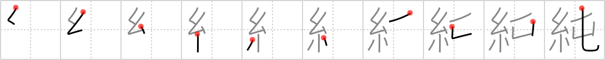

## {1494}

## `genuine`

## [10]

## Reading:

### On-Yomi: ジュン

## Words:

清純(せいじゅん): purity, innocence

純情(じゅんじょう): pure heart, naivete, self-sacrificing devotion

純粋(じゅんすい): pure, true, genuine, unmixed

単純(たんじゅん): simplicity
