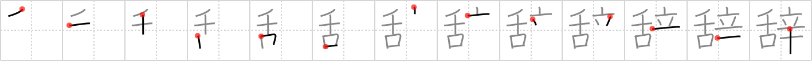

# {辞}

## `resign`

## Strokes: 13

## Reading:

### On-Yomi: ジ &mdash; Kun-Yomi: や.める、いな.む

### Examples: 辞める (や.める)

## Words:

お世辞(おせじ): flattery, compliment

辞職(じしょく): resignation

辞退(じたい): refusal

世辞(せじ): flattery, compliment

百科辞典(ひゃっかじてん): encyclopedia

御辞儀(おじぎ): bow

辞める(やめる): retire

辞典(じてん): dictionary

辞書(じしょ): dictionary, lexicon
